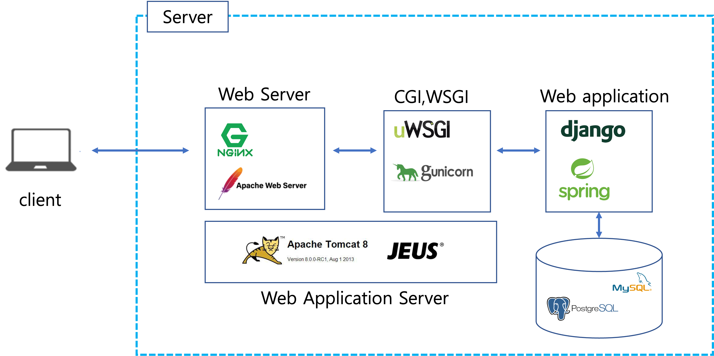

# 서블릿(Servlet)이란 ?
## 서블릿의 등장 배경
* 초창기 Web은 정적 데이터만 처리하는 Web Server여서 사용자의 요청에 따른 다양한 동적 처리가 불가능했다.
* 그래서 등장한 것이 CGI(Common Gateway Interface)

## CGI

* CGI는 서버와 응용 프로그램(외부 프로그램)이 데이터를 주고받기 위한 방법이나 규약을 뜻한다.
* 웹과 외부 프로그램은 프로토콜이 다르다. 이렇게 서로 다른 프로토콜을 연동하는 것이 소프트웨어 게이트웨이이고, 그 표준안이 CGI이다.
* 이름에서 알 수 있듯이 CGI는 Interface이다. 그래서 특정 플랫폼에 의존하지 않고 웹 서버 등으로 부터
외부 프로그램을 호출하는 조합을 말한다. 따라서 CGI를 사용하여 기동되는 프로그램 본체를 CGI로 호칭하는 것은 잘못되었다.
* CGI를 따라서 만들어진 프로그램은 CGI Program 혹은 CGI Script라고 부른다.
* CGI 동작 순서
  * 사용자가 Request를 서버로 보낸다.
  * 서버는 요청에 들어있는 주소가 CGI 프로그램에 대응되는지 확인한다.
  * 대응 된다면 그 프로그램을 실행시키고 받은 요청을 해석해 표준입력(STDIN)과 환경변수로 프로그램에 넘겨준다.
  * CGI Program은 넘겨준 데이터를 받아서 표준출력(STDOUT)으로 반환한다.
  * 서버는 반환한 결과를 받아서 올바른 HTTP 형식으로 클라이언트에게 보낸다.

## CGI를 사용하지 않는 이유
* 멀티프로세스 방식
  * 멀티 프로세스 방식은 요청이 있을 때마다 프로세스를 생성한다.
  * 이는 특히 스크립트 언어에서 치명적이다. 스크립트 언어는 보통 코드를 실행할 때마다 코드를 매번 해석해야하기 때문이다.
  * 프로세스는 자원을 상당히 많이 차지한다.
  * 이를 해결하기 위해 요청에 대응하여 프로세스가 아닌 스레드를 생성하는 자바의 Servlet이 등장했다.

## 서블릿 (Servlet)
* 