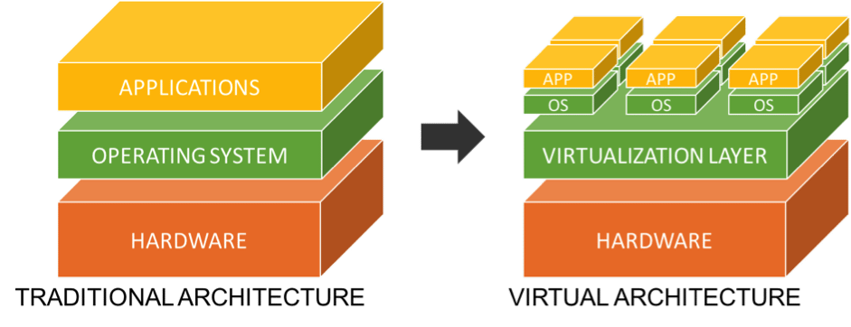
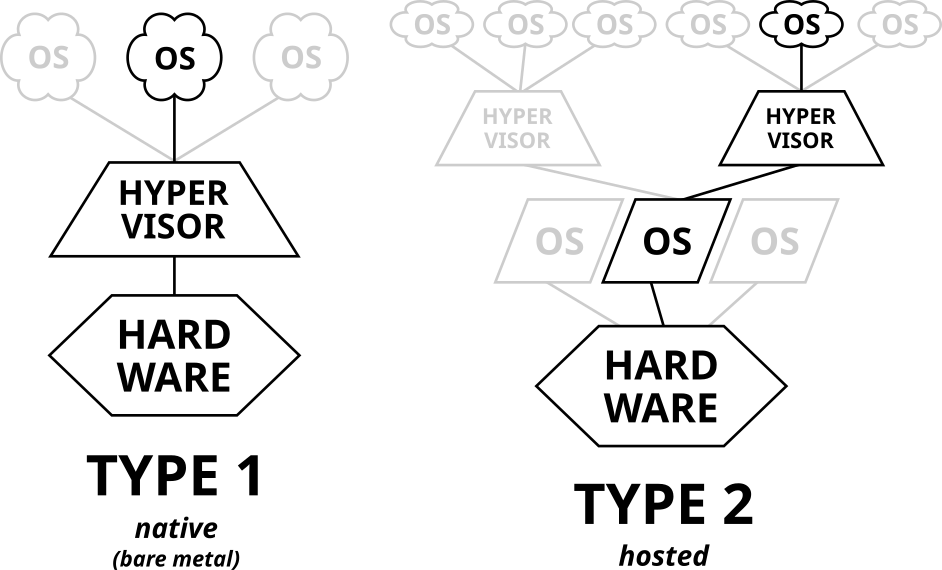

# 가상화와 컨테이너
도커는 컨테이너 기반의 가상화 도구입니다.  
저는 `가상화`에 대한 개념이 없기 때문에 우선 가상화가 무엇인지 부터 간략하게 정리해보겠습니다.

## 가상화
가상화폐는 실제로 존재하지 않지만 이를 통해 실제로 물건을 구입할 수 있는 화폐의 역할을 가집니다. 
이런 가상이라는 개념을 컴퓨터의 가상화에 대입해보면 실제로 존재하는 컴퓨터가 아니지만, 마치 존재하는 것처럼 만들어주는 기술을 말합니다.  

실제로 존재하는 것을 물리적, 가상으로 존재하는 것을 논리적으로 존재한다고 합니다.
가상화를 좀 더 기술적으로 정리하면, 물리적인 하드웨어 컴퓨팅 환경에서 여러 개의 논리적인 독립된 운영체제 인스턴스를 실행할 수 있도록 하는 기술입니다.  
(하나의 컴퓨터에서 여러개의 컴퓨터를 가진 것처럼 실행시킬 수 있음, 성능이 좋아야 함.)

### 가상화의 사용 이유
8코어/64GB 성능의 서버 컴퓨터가 있고,
그 안에서 평균적으로 1코어/8GB 메모리를 소모하는 프로그램 A 4개를 실행한다고 하면 총 소모되는 리소스는 4코어/32GB 입니다.  

OS도 리소스를 사용하기 때문에 OS도 1코어/8GB가 필요하다고 가정하면,  
총 5코어/40GB 메모리를 사용할 것 입니다.  

아직 서버 컴퓨터의 리로스에 여유가 있고, 하나의 OS에서 모두 실행되기 때문에 관리하기도 편해보입니다.  
하지만, 하나의 프로세스에서 문제가 생기면 다른 프로세스에도 문제가 생길 수 있고,  
특정 프로세스의 사용량이 급증해 리소스를 모두 소모해야한다면, 마찬가지로 나머지 프로세스가 정상적으로 동작하지 않을 수 있습니다.  

운영환경에서 이렇게 운영중인 환경이 멈추는 것은 아주 큰 문제로 이어지기 때문에 하나의 OS에서 운영하는 것은 피하는 것이 좋습니다.  

가상화를 사용하면 하나의 컴퓨터에 여러개의 논리적인 OS 환경을 사용할 수 있습니다.  
그리고 이렇게 만들어진 논리적인 환경에 사용자가 리소스를 직접 분배할 수 있습니다.(리소스의 최대값 등을 정함)  

이렇게 만들어진 논리적인 OS 환경은 필요한 총 리소스의 전체적인 양은 늘지만,  
각각의 OS가 논리적으로 서로 격리되어있기 때문에 앞서말한 문제점에 대해서 해결할 수 있습니다.  

### 하드웨어를 늘리는 방법은 왜 잘 사용하지 않을까 ?
날이 갈수록 하드웨어의 성능은 빠르게 발전하고있고, 소프트웨어의 크기는 감소하는 추세이기 때문에  
기업 입장에서는 같은 사양의 컴퓨터를 여러대 구성해서 각각 프로그램을 실행하는 것보다 성능이 좋은 하나의 하드웨어를 구성하는 것이  
설치 공간, 서버 운영 등의 많은 면에서 경제적입니다.  

## 가상화 방식
가상화 방식은 크게 하이퍼바이저 방식과 컨테이너 방식이 있습니다.  

### 하이퍼바이저
하이퍼바이저는 가상 머신(VM)을 생성하고 구동하는 소프트웨어입니다.  
가상 머신 모니터(VMM)라고도 하는 하이퍼바이저는 VM에서 하이퍼바이저 운영 체제와 리소스를 분리하고 해당 VM을 생성 및 관리할 수 있게 해줍니다.  

하이퍼바이저로 사용되는 물리 하드웨어를 호스트라고 하며 그 리소스를 사용하는 여러 VM을 게스트라고 합니다.  

정리하면, 서버 컴퓨터에 호스트OS를 설치하고 가상화 환경을 사용하기위해 하이퍼바이저를 설치해 실행하고 가상머신을 만들어서 게스트OS를 설치하고 게스트 OS에서 실행을 원하는 프로그램을 설치해 실행합니다.  

#### 하이퍼바이저의 동작
프로세스는 정상적으로 실행되기 위해 리소스를 사용해야합니다.  
프로세스가 리소스를 사용하기 위해서는 OS를 통해서 사용할 수 있는데, OS는 하드웨어의 자원을 사용하기 위해서 커널이라는 중요한 도구가 설치되어 있습니다.  

커널에게 하드웨어의 리소스를 요청하는데, 하드웨어의 리소스를 사용하는 작업은 복잡하고 조심히 다뤄야하기 때문에 커널이라는 중간다리를 거치는 것 입니다.  

커널에서는 사용요청을 전달해주는 시스템 콜이라는 표준을 따로 정의해놨습니다.  
프로세스들은 커널의 시스템 콜을 보면서 하드웨어의 자원을 요청할 수 있습니다.  

대표적인 OS인 Window, MacOS, Linux는 각각의 다른 종류의 커널을 사용하기때문에 시스템 콜도 다릅니다.  

게스트 OS의 커널은 실제로 물리적인 하드웨어가 없기 때문에 호스트 OS의 커널로 리소스 사용을 요청해야 합니다.  
하지만 OS의 종류가 다르면 호스트 OS는 게스트 OS에서 전달받은 시스템 콜을 처리할 수 없습니다.  

여기서 하이퍼바이저가 다른 커널간의 언어를 통역해주는 통역가 역할을 수행합니다.  

#### 하이퍼바이저의 종류
하이퍼바이저는 일반적으로 Type 1과 Type 2 하이퍼바이저 2가지 방식으로 나뉩니다.  

  

* Type 1 하이퍼바이저 (베어 메탈): 물리적인 하드웨어에서 직접 실행됩니다.  
별도의 호스트 운영체제가 필요하지 않으며, 바로 하드웨어 자원에 접근하여 가상 머신을 관리합니다.  
대표적인 예로는 VMware ESXi, Microsoft Hyper-V 등이 있습니다.  

* Type 2 하이퍼바이저 (호스트형): 기존의 운영체제 위에서 실행되는 소프트웨어입니다.(앞에서 설명한 하이퍼바이저 타입입니다.)  
일반적인 데스크탑 운영체제 위에서 가상 머신을 구동할 수 있게 해줍니다.  
호스트 OS가 중간에 있기 때문에 Type 1에 비해 성능은 떨어질 수 있지만, 개인 사용자나 테스트 환경에 적합합니다.  
예로는 VirtualBox, VMware Workstation이 있습니다.  

하이퍼바이저는 특정 제품이 아닌 기술의 종류입니다.

### 컨테이너 가상화
컨테이너 가상화는 말 그대로 컨테이너를 이용해서 한 컴퓨터에 여러 환경을 만들어 가상화한다는 의미입니다.  

컨테이너는 애플리케이션과 그 애플리케이션을 실행하는 데 필요한 라이브러리, 종속성 등을 패키징하여 독립적으로 실행할 수 있는 환경을 제공합니다.  
컨테이너는 프로세스 형태로 컨테이너 간 격리되며 자원 제한을 설정할 수 있습니다.  

#### 왜 컨테이너일까 ?
컨테이너는 선박을 이용해 물건을 유통할 때 사용하는 수송용 박스입니다.  
만약 컨테이너가 없다면 선박에 물건들을 마구잡이로 적재해서 유통과정에서 분실되거나 변질될 위험이 있습니다.  

반면에 컨테이너는 규격화 되어있어서 안에 무엇이 들어있는지 신경쓰지 않고 적재하면 되고 다른 교통수단으로 이동할 때에도 그대로 컨테이너 박스를 옮겨가면 됩니다.  

이처럼 컴퓨터 환경에서도 어떤 프로그램이라도 컨테이너로 추상화되어 안에는 실행할 수 있는 애플리케이션과 필요한 라이브러리, 종속성등이 있어서 컨테이너만 잘 가져온다면 따로 셋팅할 필요없이 실행이 가능합니다.

#### 하이퍼바이저와 차이점
1. 리소스 사용량: 컨테이너는 하이퍼바이저 기반 가상화에 비해 훨씬 적은 리소스를 사용합니다.  
하이퍼바이저는 각 가상 머신에 별도의 OS를 설치해야 하지만, 컨테이너는 호스트 OS의 커널을 공유하기 때문입니다.
2. 속도: 컨테이너는 가볍기 때문에 애플리케이션 시작 및 실행 속도가 빠릅니다.
3. 보안: 하이퍼바이저는 완전히 독립된 운영체제를 생성하기 때문에 더 높은 보안을 제공할 수 있지만, 컨테이너는 보안이 낮을 수 있습니다.  
이를 보완하기 위해 다양한 보안 기술이 적용되고 있습니다.

## 도커
도커(Docker)는 앞에서 설명한 컨테이너 기반 가상화 기술을 사용하여 애플리케이션을 격리된 환경에서 실행할 수 있도록 해주는 플랫폼입니다.  
이제 가상화의 개념을 얕게나마 이해했으니, 도커에 대해서 배워봅시다 !

## 참고한 사이트
[네이버클라우드-기술 경험 가상화 개념 이해하기](https://medium.com/naver-cloud-platform/%EB%84%A4%EC%9D%B4%EB%B2%84%ED%81%B4%EB%9D%BC%EC%9A%B0%EB%93%9C-%EA%B8%B0%EC%88%A0-%EA%B2%BD%ED%97%98-%EA%B0%80%EC%83%81%ED%99%94-%EA%B0%9C%EB%85%90-%EC%9D%B4%ED%95%B4%ED%95%98%EA%B8%B0-1-qemu-vs-kvm-962113641799)  
[하이퍼바이저](https://ko.wikipedia.org/wiki/%ED%95%98%EC%9D%B4%ED%8D%BC%EB%B0%94%EC%9D%B4%EC%A0%80)