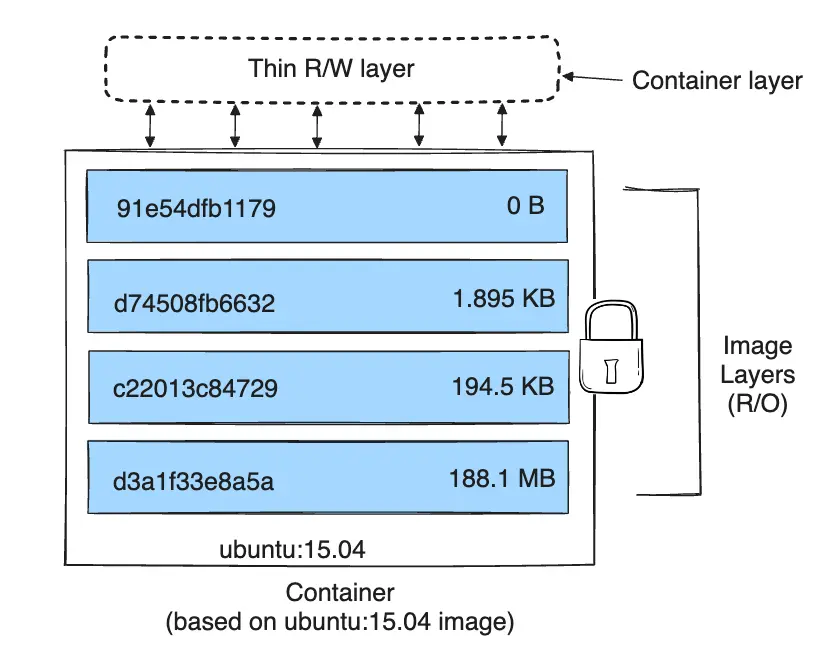
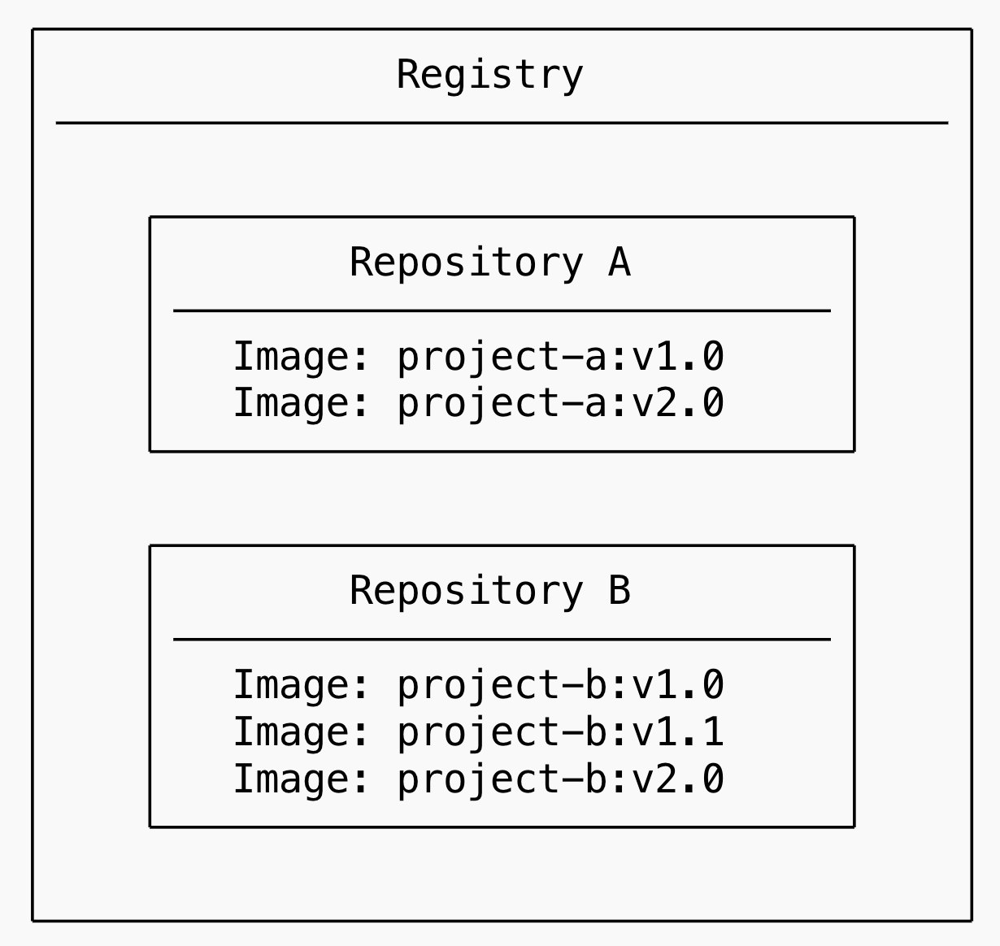

# 이미지, 레지스트리
## 컨테이너 이미지
컨테이너 이미지는 컨테이너를 생성하는 데 사용되는 실행 파일을 말합니다.  
좀더 자세히 설명하면, 컨테이너를 생성할 때 필요한 파일, 라이브러리, 애플리케이션 코드 등을 모두 포함한 파일을 말합니다.  

이미지는 공유 및 이동이 가능하므로, 동일한 이미지를 한 번에 여러 위치에 배포할 수 있습니다.  
즉, 여러 컨테이너가 동일한 이미지를 기반으로 실행될 수도 있습니다.  

* 컨테이너 이미지는 생성시 OCI(Open Container Initiative) Image Spec을 준수하게 되는데, 도커가 아닌 다른 컨테이너 도구로도 이미지를 사용할 수 있습니다.

### 이미지의 특징
* 불변성  
이미지는 한 번 생성되면 변경되지 않습니다. 이 불변성 덕분에 어디서나 일관된 실행 환경을 보장할 수 있습니다.  
예를 들어, 같은 이미지를 사용하면 다른 개발 환경에서도 동일하게 애플리케이션을 실행할 수 있습니다.
* 계층적 구조  

도커 이미지는 여러 개의 레이어(layer)어와 레이어에 대한 메타정보로 구성돼 있습니다.  
각 레이어는 이전 레이어 위에 덧붙여지며, 레이어는 파일 시스템의 변경 사항(예: 파일 추가, 삭제, 수정)을 포함합니다.  

## 이미지 레지스트리
이미지 레지스트리는 컨테이너 이미지를 저장하고 공유하기 위한 중앙 집중형 위치입니다.  
도커 이미지를 빌드한 후, 이를 레지스트리에 푸시(push) 하면, 다른 사용자나 서버에서 해당 이미지를 풀(pull) 해서 사용할 수 있습니다.

대표적인 공개 레지스트리로는 Docker Hub가 있습니다.  
기본적으로 도커 클라이언트는 Docker Hub와 통신하도록 설정돼 있지만, 프라이빗 레지스트리를 따로 설정할 수도 있습니다.

### 레포지토리

레지스트리 안에서 개별 이미지가 저장되는 장소를 말합니다.  
하나의 레포지토리에는 하나 이상의 컨테이너 이미지가 들어 있습니다.  
예를 들어, nginx라는 레포지토리에는 nginx:latest, nginx:1.19, nginx:1.20 등의 태그된 이미지들이 존재할 수 있습니다.

## 참고
[AWS](https://aws.amazon.com/ko/compare/the-difference-between-docker-images-and-containers/)  
[도커 이미지](https://docs.docker.com/get-started/docker-concepts/the-basics/what-is-an-image/)  
[도커 레이어](https://docs.docker.com/get-started/docker-concepts/building-images/understanding-image-layers/)  
[도커 레지스트리](https://docs.docker.com/get-started/docker-concepts/the-basics/what-is-a-registry/)