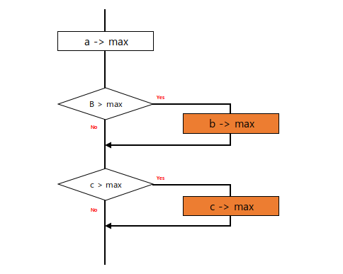
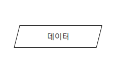
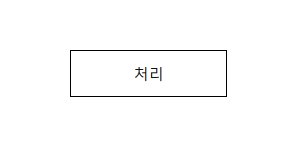
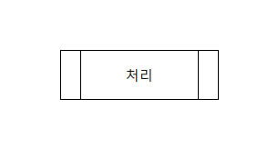
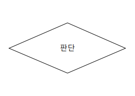
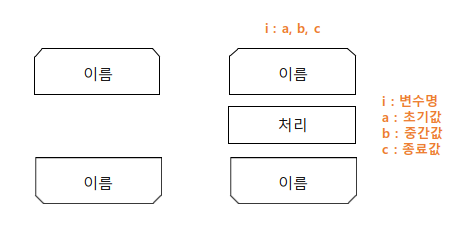
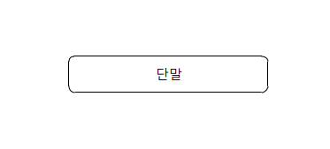
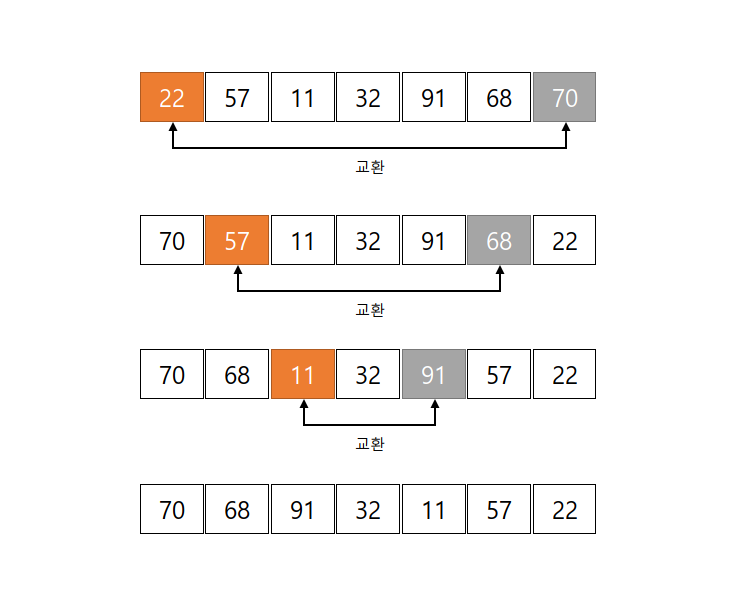

# 1장.  기본 알고리즘

## 알고리즘이란 ?
알고리즘이란 무엇인가에 대해 간단한 프로그램을 통해 알아보자.  
3개의 정숫값 가운데 '최대값'을 구하는 프로그램은 아래와 같다.  
```java
Scanner sc = new Scanner(System.in);

int a = sc.nextInt();
int b = sc.nextInt();
int c = sc.nextInt();

int max = a;
if(b > max) max = b;
if(c > max) max = c;
```
위에서 최대값을 구하는 과정을 아래와 같다.  
1. max에 a값을 넣는다.
2. b 값이 max보다 크면 max에 b 값을 넣는다.
3. c 값이 max보다 크면 max에 c 값을 넣는다.

위의 과정을 그림으로 나타내보자.  
  
이런 그림은 여러 종류가 있으며, 이 그림은 ***순서도***라고 한다.  
  
프로그램의 흐름은 검은 실선을 따라 위에서 아래로 향하고, 그 과정에서 사각형안에 작성한 처리 과정이 실행된다. 그리고 마름모를 지날 때는 그 안에 작성된 '조건'을 평가한 결과에 따라서 Yes, No중 하나를 따라간다.  
  
결과적으로 **알고리즘**은 다음과 같이 정의할 수 있다.
```
문제를 해결하기 위한 것으로, 명확하게 정의되고 순서가 있는 유한 개의 규칙으로 이루어진 집합
```  
알고리즘을 정의하고 변수의 값에 따라 결과가 맞기도하고 틀리기도 한다면 올바른 알고리즘이라 할 수 없다.  
  
<br>
<br>

## 순서도
프로그래밍 단계는 다음과 같이 이루어 진다.
  
문제의 이해 -> 논리의 설계 -> 코딩 -> 번역 -> 테스트 -> 활용
  
이중 순서도는 프로그램 논리 설계 과정에서 쓰인다.  
순서도란 문제 해결에 쓰인 논리를 단계적으로 그림으로 표현한 것을 말한다.  
또한 순서도를 이용하면 명령문들의 관계를 시각적으로 보여줄 수 있다.  

<br>
<br>

## 순서도의 기호
### 1. 데이터
  
데이터(data)의 입력과 출력을 나타낸다.
### 2. 처리
  
처리는 여러 종류의 처리 기능을 수행한다.  
ex) 데이터의 값, 자료형, 위치를 바꾸도록 정의한 연산
### 3. 미리 정의한 처리
  
**미리 정의한 처리**는 서브 루틴 및 모듈 등 다른 곳에서 이미 정의한 하나 이상의 연산 또는 명령어들로 이루어진 처리를 나타낸다.
### 4. 판단
  
판단은 하나의 입구와 하나 이상의 선택할 수 있는 출구가 있고 도형안에 정의한 조건을 평가하여  
하나의 출구를 선택하는 판단 기능을 나타낸다.
### 5. 루프 범위
  
루프 범위는 그림과 같이 두 부분으로 구성되어 루프의 시작과 루프의 종료를 나타낸다.  
루프의 시작과 종료에는 동일한 이름을 사용한다.  
그림과 같이 시작 기호 혹은 종료 기호에는 초기값, 증가값, 종료값을 표기한다.  

그림에 나와있는 두 루프 범위의 차이를 알아보기위해 while문을 떠올려보자.  
while문은 어떤 조건이 성립하는 동안 반복문 안의 내용을 처리한다.  
그러다 조건문의 조건이 true -> false가 된다면 while문을 종료한다.  
이러한 구조를 '***사전 판단 반복 구조***'라 한다.  
  
반면, 오른쪽과 같은 구조는 do-while문을 생각하면 된다.  
do-while문과 같이 우선적인 처리를 진행하고 while문 조건을 보는 것인데 이러한 구조를  
'***사후 판단 반복 구조***' 라고 한다.

### 6. 선
선은 제어의 흐름을 나타낸다. (프로그램의 논리 순서)   
주로 흐름의 방향을 분명히 나타내고자 할 때 화살표를 붙이는데, 순서도를 작성할 때도 보기 쉽게 화살표를 붙이기도 한다.

### 7. 단말
  
단말은 회부 환경으로 나가거나 외부환경으로 들어오는 것을 나타낸다.


<br>
<br>

## 구조적 프로그래밍
하나의 입구와 하나의 출구를 가진 구성 요소만을 계층적으로 배치하여 프로그램을 구성하는 방법을 '구조적 프로그래밍'이라고 합니다. 구조적 프로그래밍은 순차, 선택, 반복이라는 3종류의 제어 흐름을 사용한다.  

<br>
<br>
<br>

# 기본 자료구조

- 자료구조란 ?   
  데이터 단위와 데이터 자체 사이의 물리적 또는 논리적인 관계  
  - 데이터 단위 : 데이터를 구성하는 한 덩어리
  - 자료구조 : 자료를 효율적으로 이용할 수 있도록 컴퓨터에 저장하는 방법

<br>
<br>
<br>  

# 배열
## 배열의 최댓값 구하기
  
배열 a의 요소가 최대 3개일 때 세 요소중 최댓값은 아래처럼 구할 수 있다.
```java
max = a[0];
if(a[1] > max) max = a[1];
if(a[2] > max) max = a[2];
```
만약 배열의 요소가 많다면 아래처럼 반복문을 사용해 구할 수 있다.
```java
max = a[0];
for(i = 1; i < a.length - 1; i++){
    if(a[i] > max) max = a[i];
}
```  
  
위에서 작성한 알고리즘에 따라 배열 a의 요소에서 최댓값을 구하는 과정은  
a[i]브타 마지막 요소인 a[a.length-1]까지 차례로 살펴본다.  
이처럼 배열의 요소를 하나씩 차례로 살펴보는 과정을 알고리즘 용어로 '***주사***'라고 한다.  
  
## 배열의 요소 역순으로 정렬
{22, 57, 11, 32, 91, 68, 70}인 배열 a가 있다고 하면 요소의 개수는 7이고 역순은 {70, 68, 91, 32, 11, 57, 22}이다.  
이 과정을 그림으로 보면  
  
이러한 과정을 거친다.  
교환 횟수는 요소개수/2이며, 이 나눗셈에서 나머지는 버린다.  
그림에서 보이듯이 요소 개수가 홀수인 경우 가운데 요소는 교환할 필요가 없기 떄문이다.  
  
그럼 이것을 반복문을 통해 나타낸다면 아래와 같다.
```java
// n은 배열의 요소 개수를 가르킴(임의의 숫자)
for(int i = 0; i < n/2; i++){
  //배열의 요소를 담아둘 num 변수 생성
  int num = a[i];
  a[i] = a[n-i-1];
  a[n-i-1] = num;
}
```
  
## 기수 변환
정수값을 임의의 기수로 변환하는 알고리즘을 살펴보자.  
- 기수 : 수를 나타내는데 기초가 되는 수  

10진수를 n진수로 변환하려면 정수를 n으로 나눈 나머지를 구하는 동시에 그 몫이 0이 될 때까지 나눗셈을 반복해야한다.  
  
59를 2진수로 변환한다면 아래와 같다.
```
59 / 2 = 29 … 1
29 / 2 = 14 … 1
14 / 2 = 7 … 0
7 / 2 = 3 … 1
3 / 2 = 1 … 1
1 / 2 = 0 … 1
