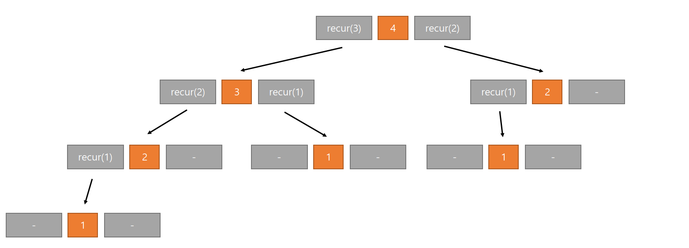

# 재귀 알고리즘
## 팩토리얼 구하기
팩토리얼을 재귀를 이용해 구하면서 재귀의 개념에 대해 알아보자.  
음이 아닌 정수n의 팩토리얼(n!)은 아래처럼 재귀적으로 정의할 수 있다.  
```
1. 0! = 1
2. n > 0이면 n! = n * (n - 1)!
```
위의 정의를 그대로 프로그램으로 구현하면 아래와 같다.
```java
public static void main(String[] args) {
    Scanner sc = new Scanner(System.in);

    int n = sc.nextInt();

    factorial(n);
}

public static int factorial(int n) {
    if (n > 0) {
        return n * factorial(n - 1);
    } else {
        return 1;
    }
}
``` 
위 코드에서 n값이 3이라고 가정하면 아래처럼 될 것이다.  
3 * factorial(2) * factorial(1) * factorial(0)  
3 * factorial(2) * factorial(1) * 1  
3 * factorial(2) * 1 * 1  
3 * 2 * 1 * 1 = 6  
  
## 직접 재귀와 간접 재귀
위의 팩토리얼 구하기처럼 자시 자신을 호출하여 작업을 수행하는 방법을 직접 재귀라고 한다.  
간접 재귀는 메서드 a, b가 있을 때 a에서 b를 호출하고 b에서 다시 a를 호출하는 구조를 말한다.  

## 유클리드 호제법
유클리드 호제법은 두개의 양의 정수 혹은 두 다항식의 최대공약수를 구하는 방법을 말한다.  
```
두 양의 정수 a,b(a > b)에 대하여 a = bq + r (0 ≤ r < b)라 하면 a,b의 최대공약수는 b,r의 최대 공약수와 같다.
즉, gcd(a, b) = gcd(b, r)
r = 0이라면 a,b의 최대공약수는 b가 된다.
```
위의 내용이 유클리드 호제법을 정의한 내용이다. 정의를 이해하기 위해 정리해보자.  
1. 두 양의 정수 A,B(A > B)가 있다. 큰 수인 A에서 B를 나눈다면 아래와 같이 표현할 수 있다.  
A = B * Q + R  
R은 A와 B를 나눈 나머지이며 Q는 몫이다.
2. 이때 A와 B의 최대공약수를 Q라고 가정하면 A = a * Q , B = b * Q (a와 b는 서로소)가 성립된다.  
3. 이 것을 위의 R에 대입해 정리하면 아래와 같다.  
R = aG - bGQ = (a - bQ)G  
그리고 아까 위에서 언급한걸 보면  
B = bG  
R과 B 모두 G라는 공통의 약수를 가지고 있다.  
4. 이제 R과 B에 있는 G라는 약수가 최대공약수가 되는지 확인해야한다.  
그래야 A,B의 최대공약수가 B, R의 최대공약수 라는 것이 증명되기 때문이다.  
그러면 (a - bG)와 b가 서로소라는 것을 증명하면 된다. (서로소는 두 수의 최대공약수가 1인 것을 서로소라고 말한다.)  
5. 서로소가 아니다라는 가정으로 접근해보자. 이 가정이 틀렸다면 서로소이기 때문이다.  
두 수가 서로소가 아니라고 가정했으니 1보다 큰 최대공약수(T)가 존재한다는 말이 된다.  
a - bQ = MT , b = NT  
b를 대입하면 a - NTQ = MT 이렇게 된다. 이걸 변형시키면 아래와 같다.  
a = MT + NTQ = T(M + NQ)  정리하면 아래와 같다.  
a = (M + NQ)T  
b = NT  
여기에서 모순이 생긴다 a와 b는 서로소이어야 한다.  
1보다 큰 최대공약수인 T를 약수로 가지고 있으므로 서로소가 아니게 된다.  
그렇다면 애초에 1보다 큰 최대공약수인 T를 가지고있다는 가정이 틀린것이 되므로 a와 b는 서로소라는 것이 증명된다.
6. 이렇게 최대공약수를 구하는 방법이 유클리드 호제법이다.  
바로 최대공약수 계산이 안되는 예를 들어 A = 1980, B = 168이라 했을 때 위의 공식을 이용해  
A = B * Q + R  
1980 = 168 * 11 + 132 (Q는 나눗셈의 몫, R은 나머지)로 나타낼 수 있다.  
그 다음 B인 168과 R인 132의 최대 공약수가 A인 1980과 B인 168과의 최대 공약수와 같다고 했으므로 최대공약수를 구해주면 되는데 아직도 구하기 어렵다.  
그렇다면 다시 공식을 사용하면 된다.  
168 = 132 * 1 + 36 이 된다 이 방식을 계속 진행해보자.  
132 = 36 * 3 + 24  
36 = 24 * 1 + 12  
24 = 12 * 2 + 0  
이렇게 마지막에는 나머지가 0이 된다. 이렇게 나머지가 0이 되었을 때의 다음은 A가 12 B가 0이 될 것이다. 여기서 0은 모든 수의 약수가 아니므로 A인 12가 최종적으로 A와 B의 최대공약수가 된다.  

### 유클리드 호제법 구현
유클리드 호제법에 대해 알아봤으니 이제 이 것을 코드로 만들어보자.  
구현 방법은 간단하다. 정수 a와 b를 입력받고 두 개를 나누고 남은 나머지를 다시 b로 그리고 b를 a로 만들어 나머지가 0이 될때까지 나눗셈을 하면된다.  
```java
public static int gcd(int a, int b) {
    if(b == 0) return a;
    else return gcd(a, b % a);
}

public static void main (String[] args) {
    Scanner sc = new Scanner(System.in);

    int a = sc.nextInt();
    int b = sc.nextInt();

    while (b > a || a == b) {
        a = sc.nextInt();
        b = sc.nextInt();
    }

    int res = gcd(a, b);
}
```

## 재귀 알고리즘 분석
재귀 알고리즘을 분석하기 위한 하향식, 상향식 분석을 알아보자.  

### 예제
```java
public static void recur(int n) {
    if (n > 0) {
        recur(n - 1);
        System.out.println(n);
        recur(n - 2);
    }
}

public static void main(String[] args) {
    Scanner sc = new Scanner(System.in);
    int n = sc.nextInt();

    recur(n);
}
```

recur 메서드는 안에서 재귀 호출을 2회 실행한다. 이처럼 재귀 호출을 여러 회 실행하는 메서드를 순수하게(genuinely) 재귀적이라 하며 실제 동작은 매우 복잡하다.  
이 메서드를 하향식과 상향식 2가지 방법으로 분석해보자.  

### 하향식 분석
처음 recur(n)을 실행하면 아래과 같이 동작할 것이다.
```
1. recur(n - 1)을 실행한다.
2. n을 출력한다.
3. recure(n - 2)을 실행한다.
```
물론 2에서 n을 출력하는 것은 recur(n - 1)에 대한 실행이 완료된 이후이다.  
n이 4라고 가정하고 아래의 그림을 보자.  

 
1. 각각을 하나의 작업으로 보고 각각의 상자는 작업의 세부단위라고 생각하자. 
2. 작업의 세부 단위는 왼쪽부터 오른쪽으로 실행된다고 생각하자.  
3. 세부 단위에 화살표로 연결된 작업이 있다면 그 작업먼저 실행해야 한다. 
4. 빈 상자를 만나면 아무것도 하지않고 다음 작업 세부 단위를 실행한다.
5. 모든 세부 단위를 실행해야 호출한 작업으로 돌아갈 수 있다.

recur(4)는 아래와 같은 순서로 실행될 것이다.  
```
1. recur(3) 실행 -> recur(2) 실행 -> recur(1)실행
2. 빈 상자를 만남 -> 1을 출력 -> 빈 상자 -> 이전 작업으로 돌아감
3. 2를 출력 -> 빈 상자 -> 이전 작업으로 돌아감
4. 3을 출력 -> recur(1)을 실행
5. 빈 상자 -> 1을 출력 -> 빈 상자 -> 이전 작업으로 돌아감 -> 이전 작업으로 돌아감
6. 4를 출력 -> recur(2)를 실행 -> recur(1)을 실행
7. 1을 출력 -> 빈 상자 -> 이전 작업으로 돌아감
8. 2를 출력 -> 빈 상자 -> 이전 작업으로 돌아감
9. 모든 작업 종료.
```
이러한 순서로 실행되어서 결과는 1, 2, 3, 1, 4, 1, 2 이 될 것이다.  
이 처럼 가장 위쪽에 위치한 작업부터 시작해 계단식으로 자세히 조사하는 기법을 ***'하향식 분석'*** 이라고 한다.  

### 상향식 분석
상향식 분석은 하향식 분석과 대조적으로 아래쪽부터 쌓아 올리며 분석하는 방법이다.  
처음에 주어지는 n이 반드시 양수라는 가정을 하고 recur(1)을 실행하면 아래와 같이 실행될 것이다.  
```
1. recur(0)을 실행
2. 1을 출력
3. recur(-1)을 실행
```
recur(0)과 recur(-1)은 실행되지 않기 때문에 1을 출력하고 종료된다. 그럼 이제 recur(2)에 대해 생각해보자.  
```
1. recur(1)을 실행
2. 2를 출력
3. recur(0)을 실행
```
recur(1)은 위에서 봤듯이 1을 출력한다. 그 다음 2를 출력하고 recur(0)은 아무것도 하지 않기 때문에 결과적으로 출력되는 결과는 1, 2 이다.