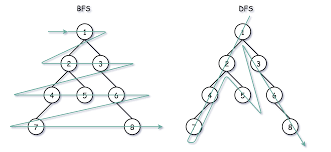
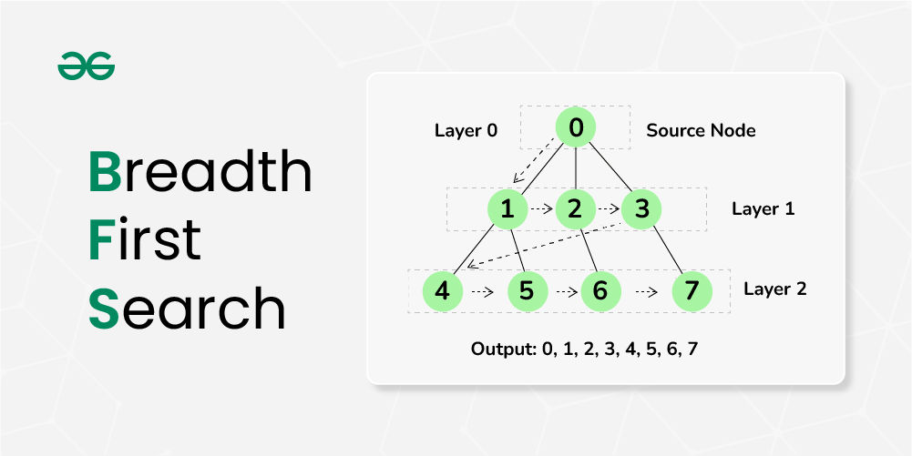

# DFS/BFS (깊이/너비 우선 탐색)



그래프 자료구조를 탐색하는 대표적인 방법으로 DFS와 BFS가 있습니다.
DFS는 Depth-First-Search의 약자로 깊이 우선 탐색이라 하고  
BFS는 Breadth-First-Search의 약자로 너비 우선 탐색이라 합니다.  

## BFS


너비 우선 탐색은 이름 그대로 탐색할 때 너비를 우선으로 탐색하는 알고리즘입니다.  

BFS는 '맹목적인 탐색'을 하고자 할 때 사용할 수 있는 탐색 기법입니다.  
너비 우선 탐색은 **최단경로**를 찾아준다는 점에서 미로찾기와 같은 문제에서 많이 사용됩니다.  

보통은 큐(Queue)로 구현을 많이 합니다.  
(먼저 들어온 것을 먼저 처리한다는 특징)

### 구현
위의 사진을 예시로 들어보겠습니다.  

1. 우선 시작 노드를 큐에 삽입하면서 시작합니다.  
그럼 큐에는 0이라는 노드가 하나 들어갑니다.  
(시작 노드를 방문했다고 '방문 처리'를 해줍니다.)
2. 그 다음 큐에서 하나의 노드를 꺼냅니다.  
(처음엔 시작노드 하나만 꺼내짐) 
3. 해당 노드에 연결된 노드 (처음에는 1와 2) 중 방문하지 않은 노드를 큐에 넣습니다.  
4. 마찬가지로 '방문 처리'를 해줍니다.
5. 2~4번 단계를 반복하면 됩니다.

결과적으로 큐에서 나온 순서는 0,1,2,3,4,5,6,7의 순서가 됩니다.

### Java 코드로 구현

우선 Graph를 먼저 정의해봅시다.
```java
class Graph {
	class Node {
		int data; // 노드의 데이터
		LinkedList<Node> adjacent; //연결된 노드 리스트
		boolean marked; // 방문처리
		public Node(int data) {
			this.data = data;
			this.marked = false;
			this.adjacent = newLinkedList<Node>();
		}
	}
	Node[] nodes; // 그래프의 노드
	Graph(int size) {
		nodes = new Node[size];
		for (int i = 0; i < size; i++) {
			nodes[i] = new Node(i);
		}
	}
	void addEdge(int i1, int i2) {
		// 두 노드의 관계를 연결하는 함수
		Node n1 = nodes[i1];
		Node n2 = nodes[i2];
		if(!n1.adjacent.contains(n2)) {
			n1.adjacent.add(n2);
		}
		if(!n2.adjacent.contains(n1)) {
			n2.adjacent.add(n1);
		}
	}
}
```
이렇게 Graph 클래스 안에 내부 클래스로 Node를 만들어주고 Node간 연결관계까지 만들어주는 addEdge()까지 만들어 줍니다.  

```java
class Graph {
	...

	void bfs(int index) {
		Node root = nodes[index];
		Queue<Node> queue = new LinkedList<(); // 새로운 Queue 생성
		queue.add(root); // queue에 노드를넣음
		root.marked = true; // 방문 표시
		while (!queue.isEmpty()) { // 큐가빌 때까지 반복
			Node r = queue.poll();  //큐에서 하나를 노드를 하나 꺼냄
			for (Node n : r.adjacent) { //꺼낸 노드와 연결된 노드들을 확인
				if(!n.marked) { // 방문한노드인지 확인
					n.marked = true; //방문 표시
					queue.add(n); // 큐에추가
				}
			}
			visit(r);
		}
	}

    void visit(Node n) {
	    System.out.print(+ n.data + " ");
	}
}
```
그 다음 위와같이 bfs를 구현해줍니다.  
위의 사진에서 설명한 것과 같은 순서로 구현하였습니다.  
큐를 만들어서 그 안에 노드를 넣고 방문 표시를 하며 연결된 노드도 확인하는 방식으로 반복문을 구현합니다.  
  
```
	  0
	 /
	1 -- 3    7
	|  / | \ /
	| /  |  5
	2 -- 4   \
		 	  6 -- 8
```
위와 같은 관계를 가지는 그래프로 테스트를 진행하면 아래와 같습니다.

```java
void solution() {
	Graph g = new Graph(9);

	// 그래프 관계 연결
	g.addEdge(0, 1);
	g.addEdge(1, 2);
	g.addEdge(1, 3);
	g.addEdge(2, 3);
	g.addEdge(2, 4);
	g.addEdge(3, 4);
	g.addEdge(3, 5);
	g.addEdge(5, 6);
	g.addEdge(5, 7);
	g.addEdge(6, 8);

	g.dfs(0);
    // 0 1 2 3 4 5 6 7 8
}
```

## DFS
깊이 우선 탐색도 이름 그대로 탐색할 때 깊은 것을 우선으로 탐색하는 알고리즘입니다.  

BFS와 마찬가지로 DFS도 '맹목적인 탐색'을 하고자 할 때 사용할 수 있는 탐색 기법입니다.    

BFS에서 보통은 큐(Queue)를 사용했다면 DFS에서는 스택(Stack)를 사용해서 구현합니다.  

추가적으로 스택을 사용하지 않아도 컴퓨터는 구조적으로 항상 스택의 원리를 사용하기 때문에 **재귀함수만으로도 구현이 가능하다는 특징**이 있습니다.

### 구현
1. 우선 시작 노드를 스택에 삽입하고 방문처리를 해줍니다.
2. 스택에서 최상단의 노드(가장 마지막에 들어온 노드)를 확인합니다.
3. 최상단 노드의 인접 노드중 방문하지 않은 노드가 있으면 그 노드를 스택에 넣고 방문처리 합니다.  
4. 방문하지 않은 인접 노드가 없으면 스택에서 최상단 노드를 뺍니다.
5. 2~4번 단계를 반복하면 됩니다.

### Java 코드로 구현

```java
class Graph {
	...

	void dfs(int index) {
		Node root = nodes[index];
		Stack<Node> stack = new Stack<(); // 새로운 Stack 생성
		stack.push(root); // Stack에 노드를넣음
		root.marked = true; // 방문 표시
		while (!stack.isEmpty()) {
			Node r = stack.pop(); //스택에서 최상단 노드를 확인
			for (Node n : r.adjacent) {  //꺼낸 노드와 연결된 노드들 확인
				if(!n.marked) { // 방문한노드인지 확인
					n.marked = true; //방문 체크
					stack.push(n); //스택에 추가
				}
			}
			visit(r);
		}
	}

	void dfsR(Node r) { // dfs 재귀함수
		if (r == null) return;
		r.marked = true; // 방문표시
		visit(r);
		for (Node n : r.adjacent) {
			if(!n.marked) { // 방문한노드인지 확인
				dfsR(n); // 재귀함수
			}
		}
	}

    void visit(Node n) {
	    System.out.print(+ n.data + " ");
	}
}
```

BFS와 동일한 그래프로 테스트를 진행하면 아래와 같습니다.

```java
void solution() {
	Graph g = new Graph(9);

	// 그래프 관계 연결
	g.addEdge(0, 1);
	g.addEdge(1, 2);
	g.addEdge(1, 3);
	g.addEdge(2, 3);
	g.addEdge(2, 4);
	g.addEdge(3, 4);
	g.addEdge(3, 5);
	g.addEdge(5, 6);
	g.addEdge(5, 7);
	g.addEdge(6, 8);

	g.bfs(0);  // 0 1 2 3 4 5 6 8 7
    g.bfsR(g.nodes[0]); // 0 1 2 3 4 5 6 8 7
}
```