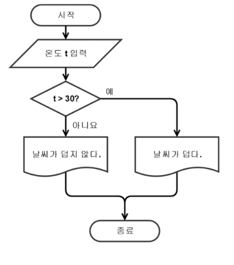

# 알고리즘

## 알고리즘이란?
유한한 단계를 통해 문제를 해결하기 위한 절차나 방법  
주로 컴퓨터용어로 쓰이며, 컴퓨터가 어떤 일을 수행하기 위한 단계적 방법을 말한다.

## 알고리즘 표현법
### 슈도코드(pseudo code)
특정 프로그래밍 언어의 문법에 따라 쓰여진게 아니라 일반적인 언어로 코드를 흉내 내어 알고리즘을 써놓은 코드를 말한다.  

작성자와 다른 사람이 이해할 수 있는 일상적인 언어(한국어, 영어 등)으로 작성하면 된다.  

#### 사용하는 이유
특정 언어로 프로그램을 작성하기 전에 알고리즘의 모델을 대략적으로 모델링 하는 곳이 쓰임  
바로 코딩하는 것에 비해서 조금 더 명확한 사고가 가능하다.  

### 순서도
프로그램이나 작업의 진행 흐름을 순서에 따라 여러 가지 기호나 문자로 나타낸 도표를 말한다.  

## 무엇이 좋은 알고리즘인가
* 정확성: 얼마나 정확하게 동작하는가
* 작업량: 얼마나 적은 연산으로 원하는 결과를 얻어내는가
* 메모리 사용량: 얼마나 적은 메모리를 사용하는가
* 단순성: 얼마나 단순한가
* 최적성: 알고리즘이 더이상 개선할 여지 없이 최적화되었는가

## 알고리즘 성능 분석
많은 문제에서 성능 분석의 기준으로 알고리즘의 작업량을 기준으로 함.

예를 들어, 숫자를 1~100까지 더하는 작업이 있다고 가정해보자.
### 알고리즘1
$1+2+3+4+5+\cdots+100=5050$  
단순히 1부터 100까지의 숫자를 더하는 알고리즘으로 연산횟수는 99번이다.

### 알고리즘2
${100*(1+100)\over2}=5050$
이 경우는 덧셈 1회, 곱셈 1회, 나눗셈 1회로 총 3번의 연산횟수를 가진다.  

단순히 연산횟수만 비교해도 알고리즘2가 성능이 좋다는 것을 알 수 있다.