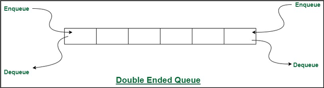

# 덱 (Deque)

덱은 Double Ended Queue의 줄임말로, 양쪽 끝에서 삽입과 삭제가 모두 가능한 자료 구조입니다.  
Deque는 큐와 스택의 특성을 모두 갖고있으며, 양쪽 끝(head, tail)에서의 삽입과 삭제가 빠르게 이루어지는 특징을 가지고 있습니다.  
이는 다시 말하면 중간에 삽입하거나 삭제하는게 불가능 하다는 의미도 됩니다.  

 

### Deque의 구조

(이미지 출처 : geeksforgeeks.org)   

#### 삽입, 삭제, 확인
head에 데이터를 추가하는 작업을 *'addFirst'*  
tail에 데이터를 추가하는 작업을 *'addLast'*   

head의 데이터를 확인하는 작업을 *'getFirst'*  
tail의 데이터를 확인하는 작업을 *'getLast'*  

head의 데이터를 확인하는 작업을 *'removeFirst'*  
tail의 데이터를 확인하는 작업을 *'removeLast'*  
