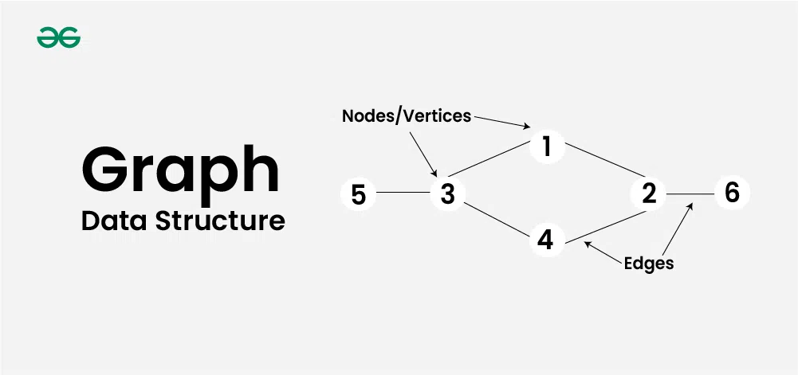
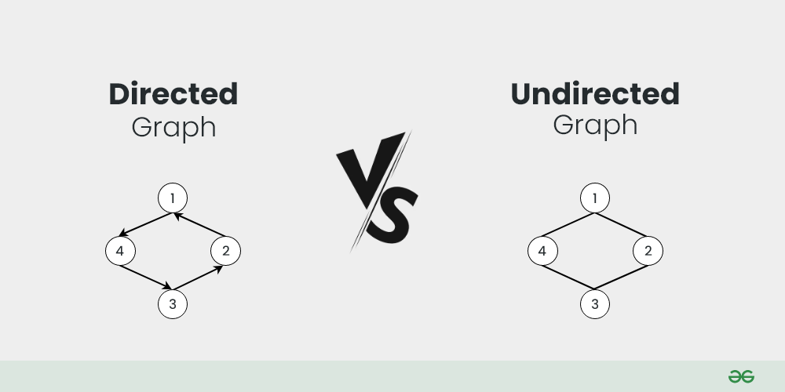
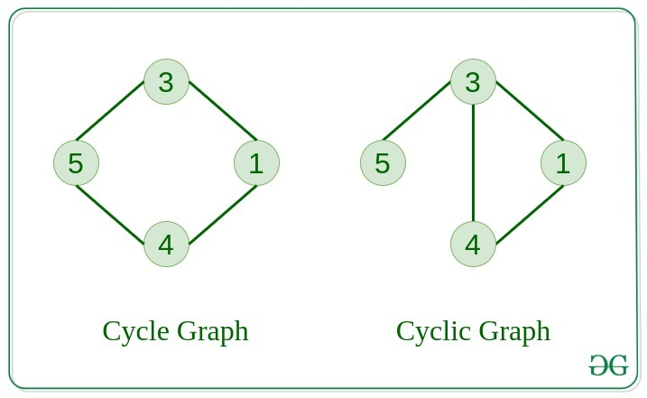
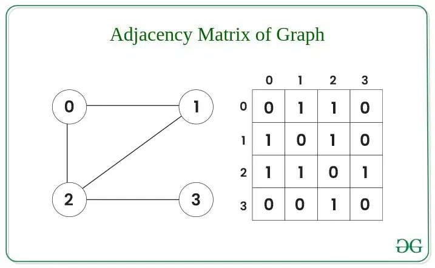
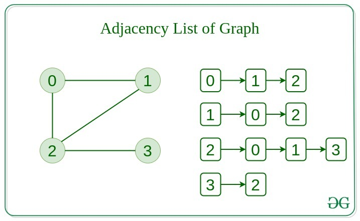

# 그래프 (Graph)
### 그래프란
그래프는 노드(Node, Vertex)와 노드들을 연결하는 간선(Edge)으로 구성된 자료구조입니다. 


<span style='font-size:11px'>(이미지 출처 : geeksforgeeks.org)</span>   

### 그래프의 종류
방향 그래프(Directed Graph)와 무방향(Undirected Graph)  



* 방향 그래프  
간선에 방향성이 있는 그래프입니다.  
한 노드에서 다른 노드로 가는 경로가 정의되어 있는 형태를 말합니다.  
(self edge라고 자기자신을 가르키는 경우도 있음)  

* 무방향 그래프  
간선에 방향성이 없는 그래프입니다.  
한 노드에서 다른 노드로 양방향으로 이동이 가능합니다.  
(tree도 방향 그래프이지만 항상 위에서 아래로 흐르기 때문에 생략하는 경우임)

  
사이클 그래프(Cyclic Graph)와 비순환 그래프(Acyclic Graph)  



* 사이클 그래프  
위 사진처럼 하나 이상의 사이클(순환 구조)가 있는 그래프를 말합니다.  

* 비순환 그래프  
하나의 사이클도 포함하지 않는 그래프를 말합니다.

연결 그래프(Connected Graph)와 비연결 그래프(Disconnected Graph)


* 연결 그래프  
모든 노드가 간선을 통해 연결된 그래프를 말합니다.

* 비연결 그래프  
모든 노드가 연결되어 있지 않은 그래프를 말합니다.


가중치 그래프(Weighted Graph)와 비가중치 그래프(Unweighted Graph)  
* 가중치 그래프  
간선에 가중치가 부여된 그래프입니다.  
간선의 가중치는 두 정점 사이의 거리, 비용 등을 나타낼 수 있습니다.

* 비가중치 그래프  
간선에 가중치가 없는 그래프입니다.

### 그래프의 표현 방법
그래프는 주로 두 가지 방법으로 표현됩니다.  
1. 인접 행렬(Adjacency Matrix)  


그래프의 노드들을 2차원 배열로 표현하는 방법입니다.  
행과 열은 그래프의 노드를 나타내며, 특정 위치의 값은 간선의 유무(또는 가중치)를 나타냅니다.  

설명을 위해 사진의 0을 기준으로 보면
```
0과 0은 연결되어 있지 않기 때문에 0  
0과 1은 연결되어 있기 때문에 1  
0과 2는 연결되어 있기 때문에 1  
0과 3은 연결되어 있지 않기 때문에 0  
```
위와 같이 설명됩니다.  

행열 방법은 두 노드 사이의 간선 존재 여부를 빠르게 알 수 있지만 메로리 사용량이 높다는 단점이 있습니다.

2. 인접 리스트(adjacency list)  
  

각 노드에 연결된 인접 노드들을 리스트로 표현하는 방법입니다.  

```
0과 인접한건 1,2
1과 인접한건 0,2
2와 인접한건 0,1,3
3과 인접한건 2
```
위와 같이 설명됩니다.  

행열과 반대로 두 노드 간의 간선 존재 여부를 확인하는데 시간이 걸리지만 메모리 사용량이 적다는 장점이 있습니다.

### 그래프 탐색 알고리즘
그래프 탐색 알고리즘 링크 연결

