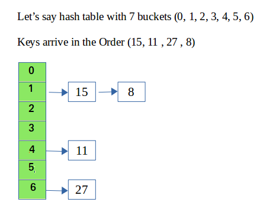
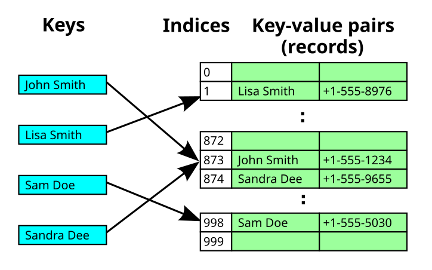

# 해시 테이블
해시 테이블은 키(key)를 특정한 해시 함수(Hash Function)를 통해서 해시값으로 변환하고 이 해시값을 인덱스로 사용해서 데이터를 저장하는 자료구조 입니다.

해시 테이블은 평균적으로 O(1)의 시간 복잡도로 데이터를 검색하고 삽입할 수 있습니다.

## 충돌
충돌은 서로 다른 두 키가 동일한 해시 값을 갖게 되어 동일한 위치에 저장되려고 하는 상황을 의미합니다.  
충돌이 발생할 경우, 이를 해결하기 위한 방법이 필요한데 일반적으로 개방 주소법(Open Addressing)과 체이닝(Separate Chaining)이라는 방법이 사용됩니다.

### 체이닝(Chaining)
체이닝은 해시 테이블의 각 버킷에 해당 인덱스로 해시된 키-값 쌍의 연결 리스트(Linked List)를 저장하는 방법입니다.  
충돌이 발생했을 때 탐사 대신, 해시 테이블은 해당 버킷의 연결 리스트에 키-값 쌍을 추가합니다.  

#### 작동원리
1. 해시 함수를 통해 키가 매핑된 인덱스를 찾습니다.
2. 만약 해당 인덱스에 이미 다른 데이터가 존재한다면, 해당 버킷에 새 데이터를 추가합니다.
3. 데이터 검색 시, 해당 인덱스로 접근한 후 버킷을 순회하면서 데이터를 찾습니다.

위의 예시에서 볼 수 있듯이, 8이라는 값이 해시 테이블에 추가될 때 인덱스 1에서 충돌이 발생해서 해당 버킷에 새 데이터를 추가한 걸 확인할 수 있습니다.
 
체이닝 방법을 사용할 때, 하나의 버킷에 연결되는 키의 수를 최소화하는 것이 좋습니다. 연결 리스트에서 요소를 검색하는 데는 O(n)의 시간이 걸리는 반면, 해시 테이블에서는 O(1)의 시간이 걸리기 때문입니다.  

### 개방 주소법(Open Addressing)
개방 주소법은 충돌이 발생할 경우, 다른 빈 슬롯(버킷)을 찾아 데이터를 저장하는 방법입니다. 이 방법은 해시 테이블 내에서만 데이터를 저장하기 때문에 추가적인 데이터 구조가 필요하지 않습니다.

개방 주소법의 종류로는 선형 탐사, 이차 탐사, 이중 해싱의 3가지 방법이 있습니다.

#### 선형 탐사
선형 탐사 방법은 충돌이 발생하면 다음 버킷(인덱스 + 1, 인덱스 + 2, ...)을 순차적으로 검색하여 빈 슬롯을 찾습니다.

선형 탐사는 클러스터링(Clustering)이 발생할 수 있다는 단점이 있습니다.  
클러스터링은 데이터가 밀집되는 현상으로, 클러스터링이 심하면 충돌이 발생했을 때 빈 버킷을 찾기 위해 많은 버킷을 탐사해야 하고, 이는 탐사 시간이 늘어나는 결과를 가져옵니다.

#### 이차 탐사
충돌이 발생하면 탐색할 다음 인덱스를 제곱수의 간격으로 검색합니다.  
예를 들어, 인덱스 + 1, 인덱스 + 4, 인덱스 + 9...

클러스터링 문제를 완화한다는 장점이 있지만, 제곱수 간격으로 검색하기 때문에 모든 슬롯을 탐색하지 못할 수도 있습니다.

#### 이중 해싱
충돌이 발생하면 두 번째 해시 함수를 사용하여 탐색할 다음 인덱스를 결정합니다.  
해시 함수를 두 번 사용함으로써 클러스터링 문제를 더욱 줄일 수 있습니다.
하지만, 해시 함수 2개가 필요하므로 구현이 복잡해질 수 있습니다.