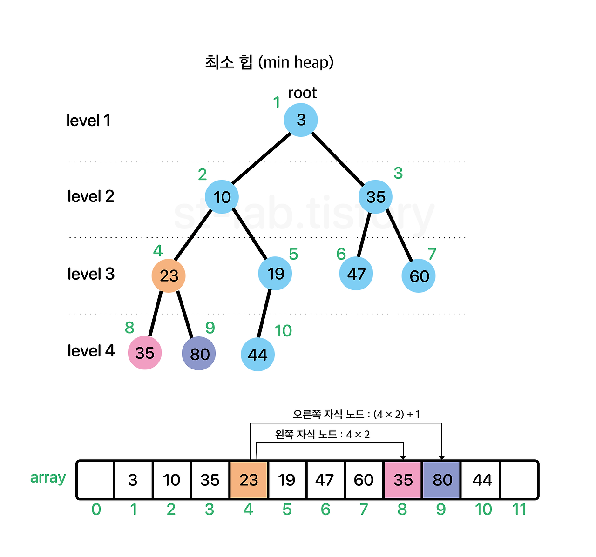
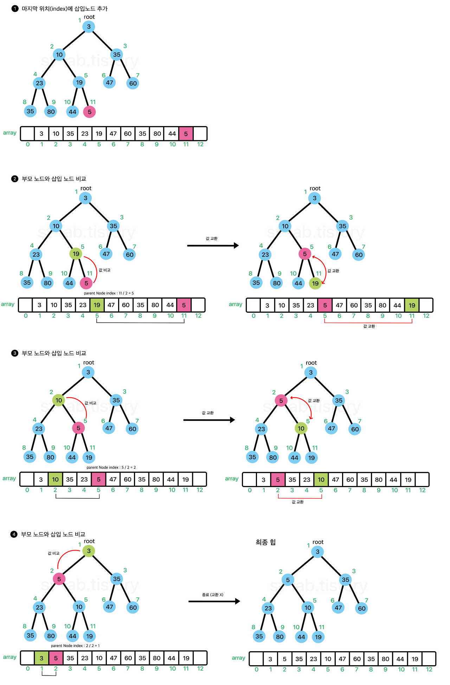
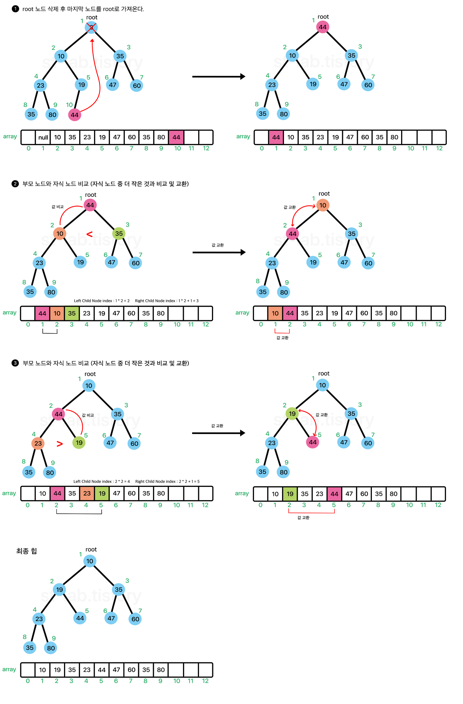

# 힙 (Heap)
힙은 완전이진트리(complete binary tree)를 기본으로 한 자료구조입니다.  
힙은 최댓값 및 최솟값을 찾아내는 연산을 빠르게 하기 위해 고안된 자료구조입니다.  

## 힙의 조건
* 완전 이진 트리 구조  
힙은 완전 이진 트리의 형태를 가지고 있습니다.  
즉, 마지막 레벨을 제외한 모든 레벨이 완전히 채워져 있으며, 마지막 레벨은 왼쪽부터 순서대로 채워져 있습니다.  

 

  
(이미지 출처 : geeksforgeeks.org)   

* 부모-자식 노드 간의 관계  
힙은 최소힙(min heap)과 최대힙(max heap)으로 나누어집니다.  
최소힙은 자식 노드보다 부모 노드의 값이 작고, 최대힙은 자식 노드보다 부모 노드의 값이 큽니다.

## 이진 탐색 트리와 비교
힙은 최소힙과 최대힙에 따라 자식 노드의 크기가 결정되고, 최소힙이라면 자식 노드는 부모 노드보다 값이 작습니다.  
이진 탐색 트리는 부모 노드의 왼쪽 자식 트리는 부모 노드보다 작고 오른쪽 자식 노드는 부모 노드보다 큽니다.  
[이진 탐색 트리](BST.md)

## 힙의 구현
힙의 구현은 배열을 사용해서 구현합니다.  
또한 아래와 같은 성질을 이용합니다.  
### 구현에 필요한 힙의 성질
* 왼쪽 자식 노드 인덱스 = 부모 노드 인덱스 * 2
* 오른쪽 자식 노드 인덱스 = 부모 노드 인덱스 * 2 + 1
* 부모 노드 인덱스 = 자식 노드 인덱스 / 2  
(몫만 취함)

  

### 힙에 원소가 추가되는 과정
  

배열에 원소를 넣고 부모 노드와 값을 비교해 위치를 교환하는 식으로 루트 노드까지 비교를 하여 원소를 추가합니다.
위와 같은 과정을 흔히 위로 올라가면서 선별한다고 하여 sift-up(상향 선별)이라고 합니다.

### 힙에서 원소를 제거하는 과정
  

* 우선 루트 노드를 제거합니다.(최소값, 최대값을 찾기 용이)  
* 맨 마지막 노드를 루트 노드로 가져온 후 자식 노드들과 값을 비교해서 값이 더 작은 노드와 위치를 바꿉니다.
* 위의 방법을 비교가 되지 않을 때까지 반복해서 정렬을 마무리 합니다.

위 과정과 같이 아래로 내려가면서 재배치하는 과정을 sift-down(하향 선별)이라고 합니다.