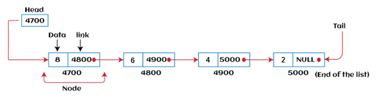
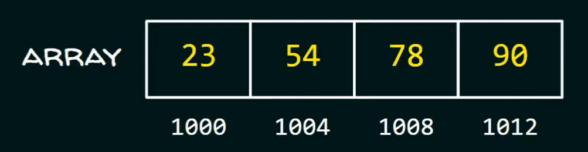
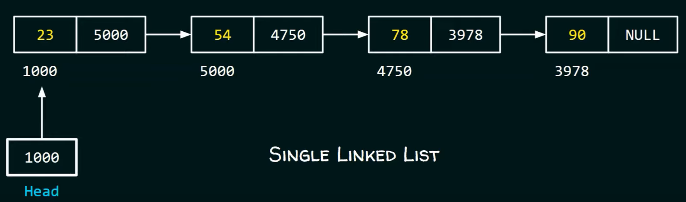

# 연결 리스트 (Linked List)

## Linked List란 ?
연결리스트는 Array와는 다르게 element와 element 간의 연결(Link)을 이용해서 구현한 것을 의미합니다.  

<br>

## Linked List의 구조와 특징

### 노드
Linked List는 **노드**라는 것으로 이루어져 있습니다.  

노드는 ***data***와 다른 노드의 주소값인 ***link***로 이루어져 있습니다.  
사진과 같이 주소값이 4700인 노드에는 해당 노드와 연결된 노드의 주소값인 4800이 있습니다.  
그리고 마지막 노드에는 연결된 노드가 없기 때문에 link가 Null입니다.  
  
첫번 째 노드의 주소를 알면 모든 노드에 연결될 수 있습니다.  
그래서 첫번 째 노드를 알기위해서 포인터<span style='font-size:11px'>(여기서는 Head라고 부름)</span>가 필요합니다.
  
<br>

### 배열과의 차이점

```배열의 저장방식```
  
<span style='font-size:11px'>(이미지 출처 : Neso Academy 유튜브)</span>  
첫번 째 정수의 주소값이 1000이고, 정수의 크기가 4byte라고 가정했을 때 위와같이 데이터가 저장됩니다.  
이처럼 배열에서 각 데이터는 ***연속적인 메모리 위치에 저장***됩니다.  

```연결 리스트의 저장방식```
  
<span style='font-size:11px'>(이미지 출처 : Neso Academy 유튜브)</span>  
연결 리스트는 배열과 다르게 데이터가 순차적으로 저장될 필요가 없습니다.  
각각의 노드에 데이터와 다음 노드를 연결해주는 주소값을 가지고 있기 때문에 메모리의 무작위적인 위치에 저장됩니다.  
  
배열은 데이터를 추가하거나 삭제할 때 매우 불리한 구조입니다.  
하지만 연결 리스트는 이와 반대로 데이터의 추가/삽입에 유리합니다.  
예를들어, 추가로 23과 54사이에 34라는 숫자를 삽입하려한다면 Data는 34, 주소값은 5000으로된 노드를 만들고 23의 주소값을 해당 노드의 주소값으로 변경하면 됩니다.  

이렇게 배열의 단점인 데이터의 추가/삭제를 좀 더 용이하게 할 수 있다는 장점이 있습니다.

<br>

### Linked List의 단점
데이터를 조회할 때 처음부터 순차적으로 탐색해야하기 때문에 데이터 조회속도가 느릴 수 있습니다.

<br>

### Linked List 종류
1. 단일 연결 목록 : Linked List의 기본형을 말하며, 탐색이 노드가 가르키는 한 쪽 방향으로만 수행됩니다.
2. 이중 연결 목록 : 정방향 및 역방향으로 탐색이 가능합니다.
3. 순환 연결 목록 : 마지막 노드가 첫번 째 노드와 연결됩니다.

<br>

## 연결 리스트의 구현