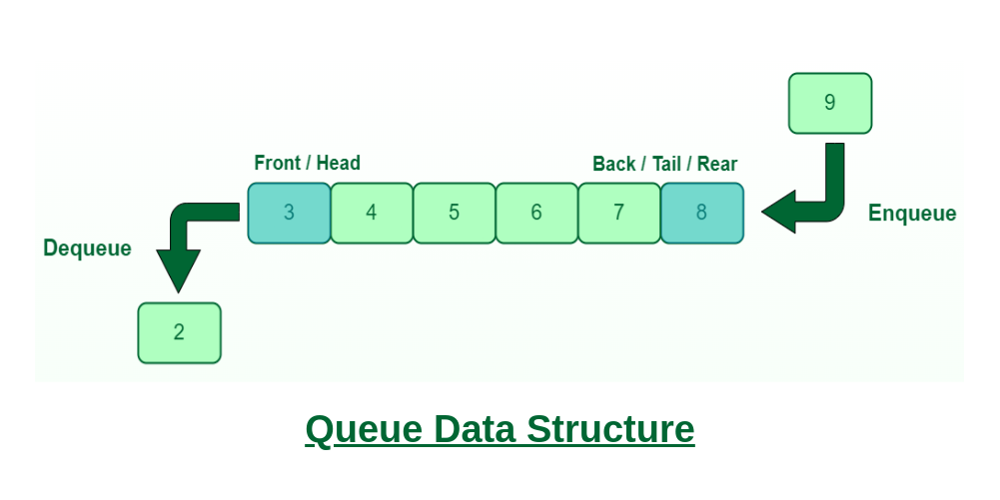

# 큐 (Queue)

### FIFO
Queue는 **FIFO**라는 특성을 가지는 데이터 구조 입니다.  
FIFO는 선입선출(First In First Out)의 원칙을 말하는데, 먼저들어온 데이터가 먼저 처리된다는 의미입니다.
   
FIFO
삽입과 삭제 enqueue, dequeue
front와 rear 포인터
스레드 세이프
구현
  
<br>

### Queue의 구조와 구현
  
<span style='font-size:11px'>(이미지 출처 : geeksforgeeks.org)</span>   

#### 삽입과 삭제  
큐에 데이터를 추가하는 작업을 *"enqueue"* 삭제하는 작업을 *"dequeue"*라고 합니다.  

#### Front와 Rear포인터  
Queue자료구조에서 Front와 Rear 포인터는 큐의 시작과 끝을 나태는 두 가지 포인터입니다.  

Front는 큐의 맨 앞 요소를 가리킵니다.  
Queue에서 요소를 제거할 때 사용됩니다.  
  
Rear는 큐의 맨 뒤 요소를 가리킵니다.  
Queue에서 요소를 추가할 때 사용합니다.  

주의할 점은 Front와 Rear 포인터가 같은 위치를 가리키는 경우 Queue가 비어있거나 모든 요소가 제거된 상태를 나타낸다는 것입니다.

### 스레드 세이프  
멀티스레드 환경에서 큐를 사용할 때 여러 스레드가 동시에 큐에 접근할 수 있기 때문에, 동시성 제어가 필요합니다.  


### Queue의 구현
```java
public class Main {
    public class Queue<T> {
        private static final int DEFAULT_CAPACITY = 10;
        private Object[] array;
        private int front;
        private int rear;
        private int size;

        public Queue() {
            this.array = new Object[DEFAULT_CAPACITY];
            this.front = 0;
            this.rear = -1;
            this.size = 0;
        }
        
        public Queue(int capacity) {
            this.array = new Object[capacity];
            this.front = 0;
            this.rear = -1;
            this.size = 0;
        }

        public void enqueue(T item) {
            if(isFull()) {
                throw new IllegalStateException("Queue is full");
            }
            rear = (rear + 1) % array.length;
            array[rear] = item;
            size++;
        }

        public T dequeue() {
                if (isEmpty()) {
                    throw new IllegalStateException("Queue is empty");
                }
                T item = (T) array[front];
                array[front] = null; // 참조 해제
                front = (front + 1) % array.length;
                size--;
                return item;
        }
    
        public T peek() {
            if (isEmpty()) {
                throw new IllegalStateException("Queue is empty");
            }
            return (T) array[front];
        }

        public boolean isEmpty() {
            return size == 0;
        }

        public boolean isFull() {
            return size == array.length;
        }

        public int size() {
            return size;
        }
    }

    public static void main(String[] args) {
        // 큐 생성
        Queue<Integer> queue = new Queue<>();

        // 큐에 데이터 추가
        queue.enqueue(10);
        queue.enqueue(20);
        queue.enqueue(30);
        queue.enqueue(40);

        // 큐의 상태 출력
        System.out.println("Queue size: " + queue.size());

        // 큐의 데이터 출력 (삭제하지 않고 확인)
        System.out.println("Front element: " + queue.peek());

        // 큐에서 데이터 제거
        int removedElement = queue.dequeue();
        System.out.println("Removed element: " + removedElement);

        // 큐의 상태 출력
        System.out.println("Queue size after removal: " + queue.size());
    }
}


```
