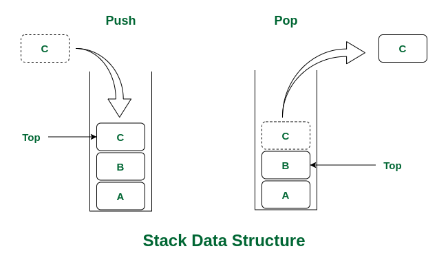

# 스택 (Stack)

### LIFO
Stack은 **LIFO**라는 특성을 가지는 데이터 구조 입니다.  
LIFO는 후입선출(Last In First Out)이라고 하는데, 가장 최근에 들어온 것이 제일 먼저 나가야 한다는 뜻입니다.  
  
우리 실생활에서 예시를 들어봅시다.
  
접시가 사진처럼 쌓여있을 때 중간에 있는 접시를 꺼내고 싶다면  
오른쪽 사진처럼 위쪽에 있는 접시(꺼내려는 접시보다 나중에 쌓여진 접시)를 꺼낸 후 중간에 있는 접시를 꺼낼 수 있습니다.  

스택 자료 구조도 마찬가지로 가장 최근에 들어온 데이터가 가장 먼저 나가야하는 구조로 이루어져 있습니다.  
  
 

### 작동
  
(이미지 출처 : geeksforgeeks.org)  

스택의 추상자료형(Abstract Data Type - ADT)를 보면 입력연산은 **Push**, 출력연산은 **Pop**이라고 합니다.  
그리고 조회연산은 **Peek**라고 하는데, **Top 포인터**가 가리키는 데이터를 확인만하고 Top의 인덱스는 변화시키지 않는 연산입니다.  
  
 

## 스택의 구현
