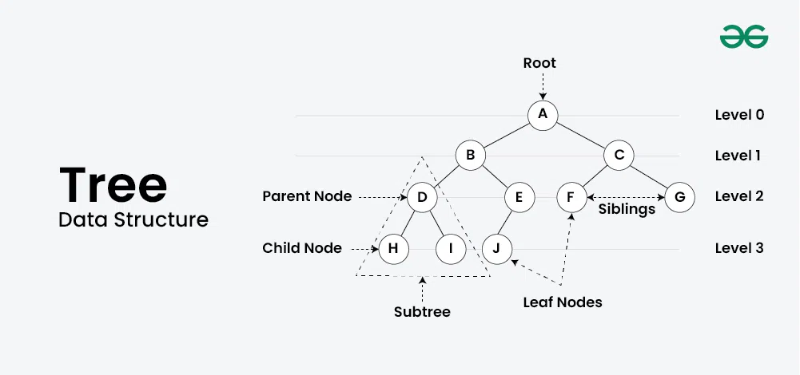
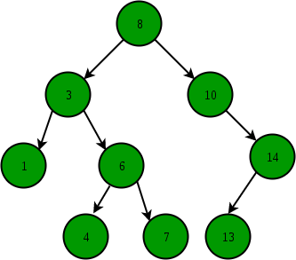
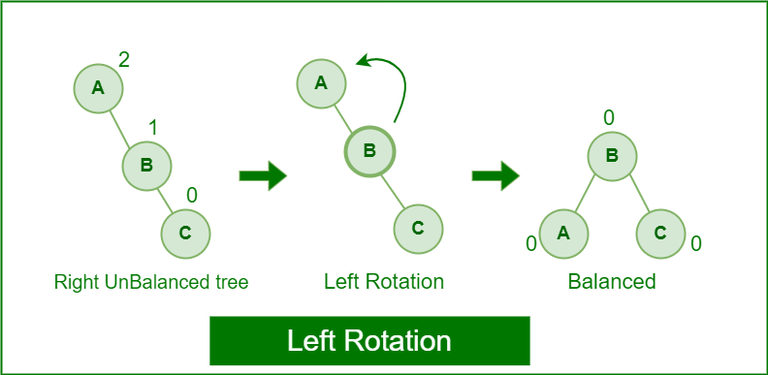
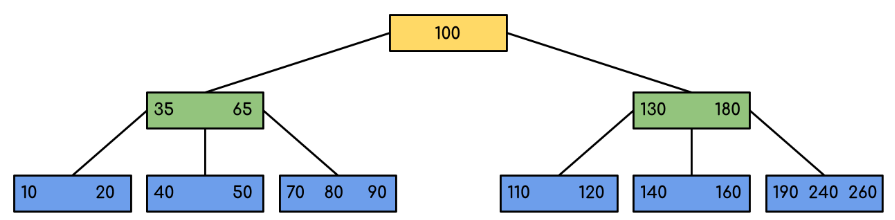

# 트리 (Tree)

트리는 계층적 구조를 나타내는 비선형의 자료구조를 말합니다.  
트리는 **노드(Node)** 라는 것들의 집합으로 이루어져 있고, 하나의 루트 노드를 가지며 이 루트 노드에서부터 다른 노드를 연결하는 간선으로 구성됩니다.  
간선은 부모 노드와 자식 노드를 연결하며, 각 노드는 최대 하나의 부모 노드와 여러 개의 자식 노드를 가질 수 있습니다.  

### 노드(Node)
1. 루트 노드(Root Node) : 트리의 가장 상위에 있는 노드를 말합니다.  
2. 부모 노드(Parent Node) : 어떤 노드의 상위에 있는 노드를 말합니다.  
각 노드는 정확하게 하나의 부모 노드를 가집니다.  
3. 자식 노드(Children Node) : 어떤 노드의 하위에 있는 노드들을 말합니다.  
각 노드는 여러 개의 자식 노드를 가질 수 있습니다.  
4. 리프 노드(Leaf Node) : 자식 노드가 없는 노드를 말합니다.  
5. 부트리(Subtree) : 어떤 노드와 그 노드의 모든 자손 노드들로 이루어진 부분 트리를 말합니다.  
  
 

### Tree의 구조

(이미지 출처 : geeksforgeeks.org)   

 

### Tree의 종류
#### 이진 트리(Binary Tree)
  
(이미지 출처 : geeksforgeeks.org)   
각 노드가 최대 두 개의 자식 노드를 가지는 트리입니다.  

#### 이진 탐색 트리(Binary Search Tree, BST)

이진 트리의 한 종류로, 모든 왼쪽 자식 노드는 현재 노드보다 작은 값을 가지고 모든 오른쪽 자식은 현재 노드보다 큰 값을 가진다는 특징이 있습니다.  
이진 탐색 트리에서는 데이터의 검색, 삽입, 삭제를 효율적으로 수행할 수 있습니다.  

#### AVL 트리(AVL Tree)

균형 잡힌 이진 탐색 트리로 노드를 삽입하거나 삭제할 때 자동으로 균형을 조정하여 트리의 높이를 최소화합니다.  
각 노드의 왼쪽 서브트리와 오른쪽 서브트리의 높이 차이가 항상 1 이하로 유지됩니다.  

#### B 트리(B-Tree)

데이터베이스와 파일 시스템에서 사용되는 트리 구조로, 각 노드가 여러 개의 자식을 가질 수 있습니다.  
대용량 데이터를 저장하고 검색할 때 기존 이진 검색 트리는 성능이 낮고 메모리 사용량이 높아 실용적이지 않을 수 있습니다.  
기존 이진 검색 트리와 달리 B-트리는 단일 노드에 저장할 수 있는 키의 수가 많기 때문에 더 큰 분기 요소를 가지므로 트리의 높이를 최소화할 수 있습니다.