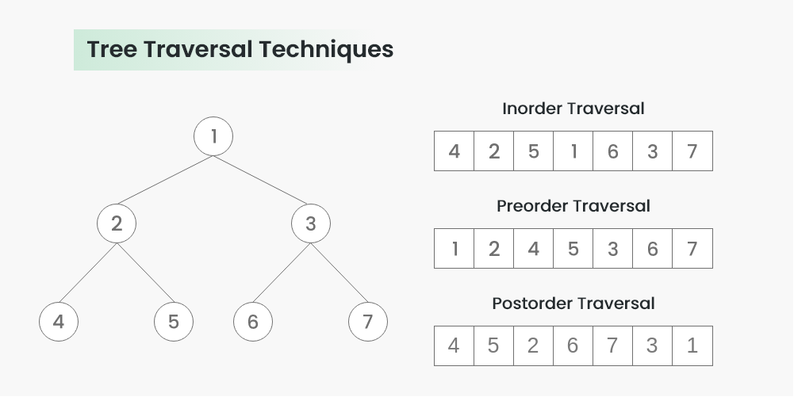

# 트리 (Tree)

트리는 계층적 구조를 나타내는 비선형의 자료구조를 말합니다.  
트리는 **노드(Node)** 라는 것들의 집합으로 이루어져 있고, 하나의 루트 노드를 가지며 이 루트 노드에서부터 다른 노드를 연결하는 간선으로 구성됩니다.  
간선은 부모 노드와 자식 노드를 연결하며, 각 노드는 최대 하나의 부모 노드와 여러 개의 자식 노드를 가질 수 있습니다.  

### 노드(Node)
1. 루트 노드(Root Node) : 트리의 가장 상위에 있는 노드를 말합니다.  
2. 부모 노드(Parent Node) : 어떤 노드의 상위에 있는 노드를 말합니다.  
각 노드는 정확하게 하나의 부모 노드를 가집니다.  
3. 자식 노드(Children Node) : 어떤 노드의 하위에 있는 노드들을 말합니다.  
각 노드는 여러 개의 자식 노드를 가질 수 있습니다.  
4. 리프 노드(Leaf Node) : 자식 노드가 없는 노드를 말합니다.  
5. 부트리(Subtree) : 어떤 노드와 그 노드의 모든 자손 노드들로 이루어진 부분 트리를 말합니다.  
  
<br>

### Tree의 구조

<span style='font-size:11px'>(이미지 출처 : geeksforgeeks.org)</span>   

- 크기(size): 트리에 포함된 모든 노드의 개수
- 깊이(depth): 루트 노드로부터 거리
- 높이(height): 깊이 중 최댓값
- 차수(degree): 각 노드의 (자식 방향) 간선 개수  
  
기본적으로 트리의 크기가 N일 때, 전체 간선의 개수는 N - 1개 입니다.  

<br>

### Tree의 종류
#### 이진 트리(Binary Tree)
  
<span style='font-size:11px'>(이미지 출처 : geeksforgeeks.org)</span>   

각 노드가 최대 두 개의 자식 노드를 가지는 트리입니다.  

#### 이진 탐색 트리(Binary Search Tree, BST)
  
<span style='font-size:11px'>(이미지 출처 : geeksforgeeks.org)</span>   

이진 트리의 한 종류로, 모든 왼쪽 자식 노드는 현재 노드보다 작은 값을 가지고 모든 오른쪽 자식은 현재 노드보다 큰 값을 가진다는 특징이 있습니다.  
이진 탐색 트리에서는 데이터의 검색, 삽입, 삭제를 효율적으로 수행할 수 있습니다.  

#### AVL 트리(AVL Tree)
  
<span style='font-size:11px'>(이미지 출처 : geeksforgeeks.org)</span>   

균형 잡힌 이진 탐색 트리로 노드를 삽입하거나 삭제할 때 자동으로 균형을 조정하여 트리의 높이를 최소화합니다.  
각 노드의 왼쪽 서브트리와 오른쪽 서브트리의 높이 차이가 항상 1 이하로 유지됩니다.  

#### B 트리(B-Tree)
  
<span style='font-size:11px'>(이미지 출처 : geeksforgeeks.org)</span>   

데이터베이스와 파일 시스템에서 사용되는 트리 구조로, 각 노드가 여러 개의 자식을 가질 수 있습니다.  
대용량 데이터를 저장하고 검색할 때 기존 이진 검색 트리는 성능이 낮고 메모리 사용량이 높아 실용적이지 않을 수 있습니다.  
기존 이진 검색 트리와 달리 B-트리는 단일 노드에 저장할 수 있는 키의 수가 많기 때문에 더 큰 분기 요소를 가지므로 트리의 높이를 최소화할 수 있습니다.

### 이진 탐색
이진 탐색(Binary Search)는 정렬된 배열이나 리스트에서 특정 값을 찾는 알고리즘입니다.  

이진 탐색 알고리즘은 다음과 같은 방법으로 동작합니다.  
```
1. 중앙값 선택 : 배열이나 리스트의 중앙에 있는 값을 선택합니다.
2. 중앙 값과 비교 : 선택한 중앙 값과 찾고자 하는 값을 비교합니다.
3. 탐색 범위 축소 : 찾고자 하는 값이 작으면 왼쪽에 있는 리스트를 대상으로 탐색을 계속하고, 값이 크면 오른쪽에 있는 리스트를 대상으로 탐색을 합니다.
4. 반복 또는 종료 : 위의 과정을 반복하여 찾고자 하는 값을 찾을 때까지 탐색을 계속하거나, 탐색 범위가 축소되지 않을 때까지 반복합니다.
만약 탐색 범위가 더이상 축소되지 않는다면(= 탐색 범위가 없다면) 찾고자 하는 값이 존재하지 않는 것으로 판단합니다.
```  
이진 탐색은 분할 정복(Divide and Conquer)알고리즘의 일종으로, 탐색 범위를 반으로 나누어 가며 찾고자 하는 값을 효율적으로 탐색합니다.  
이 알고리즘은 정렬된 배열이나 리스트에서만 사용할 수 있지만, 시간 복잡도가 O(log_n)으로 매우 효율적입니다.  

### 트리의 순회(Tree Traversal)
  
<span style='font-size:11px'>(이미지 출처 : geeksforgeeks.org)</span>   

트리의 순회 방법에는 전위 순회, 중위 순회, 후위 순회라는 세 가지 주요한 방법이 있습니다.  
각 순회 방법은 트리의 노드를 언제 방문하는지에 따라 다릅니다.
#### 전위 순회(Preorder Traversal)
루트 노드를 먼저 방문한 후, 왼쪽 서브트리를 전위 순회한 뒤에 오른쪽 서브트리를 전위 순회 합니다.  
상단의 그림에서 보이듯이 1,2,4,5,3,6,7의 순서로 순회합니다.

#### 중위 순회(Inorder Traversal)
왼쪽 서브트리를 중위 순회한 후에 루트 노드에 방문하고 그 다음 오른쪽 서브트리를 중위 순회 합니다.  
상단의 그림에서 보이듯이 4,2,5,1,6,3,7의 순서로 순회합니다.  

#### 후위 순회(Postorder Traversal)  
왼쪽 서브트리를 후위 순회한 후에 오른쪽 서브트리를 후위순회하고 마지막에 루트를 방문합니다.  
상단의 그림에서 보이듯이 4,5,2,6,7,3,1의 순서로 순회합니다.

### 각 순회 방법의 구현
Node의 클래스는 아래와 같습니다.
```java
class TreeNode {
    int val;
    TreeNode left;
    TreeNode right;

    public TreeNode(int val) {
        this.val = val;
    }
}

public class TreeTraversal {
    // 전위 순회
    public void preOrder(TreeNode root) {
        if (root == null) return;

        System.out.print(root.val + " "); // 루트 방문
        preOrder(root.left); // 왼쪽 서브트리 순회
        preOrder(root.right); // 오른쪽 서브트리 순회
    }

    // 중위 순회
    public void inOrder(TreeNode root) {
        inOrder(root.left); // 왼쪽 서브트리 순회
        System.out.print(root.val + " "); // 루트 방문
        inOrder(root.right); // 오른쪽 서브트리 순회
    }

    // 후위 순회
    public void postOrder(TreeNode root) {
        inOrder(root.left); // 왼쪽 서브트리 순회
        inOrder(root.right); // 오른쪽 서브트리 순회
        System.out.print(root.val + " "); // 루트 방문
    }
    
    public static void main(String[] args) {
        // 테스트를 위한 트리 생성
        TreeNode root = new TreeNode(1);
        root.left = new TreeNode(2);
        root.right = new TreeNode(3);
        root.left.left = new TreeNode(4);
        root.left.right = new TreeNode(5);
        root.right.left = new TreeNode(6);
        root.right.right = new TreeNode(7);

        TreeTraversal traversal = new TreeTraversal();
        System.out.println("전위 순회 결과:");
        traversal.preOrder(root);
        
        System.out.println("중위 순회 결과:");
        traversal.inOrder(root);
        
        System.out.println("휘위 순회 결과:");
        traversal.postOrder(root);
    }
}
```