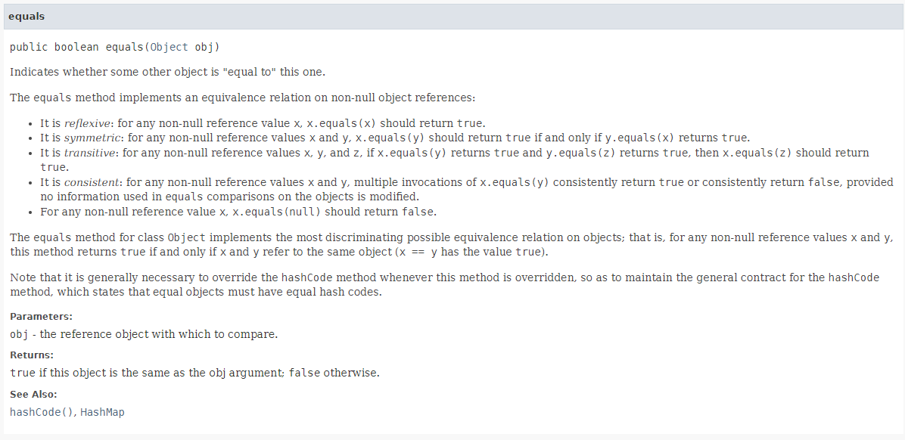

# Item 10. equals는 규약을 지켜 재 정의 하라 
Object final이 아닌 메서드 (equals, hashCode, toString, clone, finalize)는 모두 재정의(overriding)를 염두에 두고 설계된 것이라 재정의 시 지켜야 하는 일반 규약이 명확하게 정의되어있다.  

## equals의 재정의는 신중하게
equals는 재정의하기 쉬워 보이지만, 곳곳에 함정이 도사리고 있다.  
문제를 회피하는 가자 쉬운 길은 아예 재정의를 하지 않는 것이다.  
그러니 다음에서 열거한 상황 중 하나에 해당한다면 재정의하지 않는 것이 최선이다.  
* 각 인스턴스가 본질적으로 고유하다.  
Interger나 String처럼 값을 표현하는 클래스가 아닌 동작하는 개체를 표현하는 클래스가 여기 해당한다.  
예시 : Thread
* 인스턴스의 '논리적 동치성'을 검사할 일이 없다.  
java.util.regex.Pattern은 equals를 재정의해서 두 Pattern의 인스턴스가 같은 정규표현식을 나타내는지를 검사하는 논리적 동치성을 검사한다.  
* 상위 클래스에서 재정의한 equals가 하위 클래스에도 딱 들어맞는다.  
예시로 Set 구현체는 AbstractSet이 구현한 equals를 상속받아 쓰고, List 구현체들은 AbstractList로 부터, Map 구현체들은 AbstractMap으로부터 상속받아서 그냥 사용한다.
* 클래스가 private이거나 package-private이고 equals 메서드를 호출할 일이 없다.  
실수로라도 호출되는 걸 막고싶을 때는 아래와 같이 구현해두자.  
```java
@Override
public boolean equals(Object o) {
    throw new AssertionError();
}
```  

## equals를 재정의해서 사용해야 하는 경우
equals는 객체의 식별성(두 객체가 물리적으로 같은가)이 아니라 논리적 동치성을 확인해야 하는데, 상위 클래스의 equals가 논리적 동치성을 비교하도록 재정의되지 않았을 때다.  

주로 값을 표현하는 클래스(Integer, String 등)가 여기에 해당한다.  

값을 표현하는 객체를 비교하는 프로그래머는 객체가 같은지가 아니라, 값이 같은 지를 비교하고 싶을 것 이다.  
equals가 논리적 동치성이 같은지 확인하도록 재정의해두면 그 인스턴스는 값을 비교하길 원하는 프러그래머의 기대에 부응하면서 Map의 키와 Set의 원소로 사용할 수 있게된다.  
  
하지만, 값 클래스여도 같은 인스턴스가 둘 이상 만들어지지 않는 인스턴스 통제 클래스라면 재정의하지 않아도 된다.  
(Enum이 여기에 해당한다.)  
어차피 논리적으로 같은 인스턴스가 2개 이상 생성되지 않으니 논리적 동치성과 객체 식별성이 사실상 똑같은 의미가 되기 때문이다.  

## equals 재정의 일반 규약
equals를 재정의하기 위해서는 반드시 일반 규약을 따라야 한다.

  

equals 메서드는 동치관계를 구현하며 다음을 만족한다.  
* 반사성(reflexive): null이 아닌 모든 참조 값 x에 대해, x.equal(x) true다.
* 대칭성(symmetric): null이 아닌 모든 참조 값 x,y에 대해 x.equals(y)가 true면 y.equals(x)도 true다.
* 추이성(transitivity): null이 아닌 모든 참조 값 x, y, z에 대해 x.equals(y)가 true고, y.equals(z)가 true면 x.equals(z)도 true다.
* 일관성(consistent): null이 아닌 모든 참조 값 x, y에 대해 x.equals(y)를 반복해서 호출하면 항상 true를 반환하거나 false를 반환한다.
* null이 아닌 모든 참조 값 x에 대해 x.equals(null)은 false다.  

상기의 규약을 어기면 프로그램이 이상하게 동작하고 원인이 되는 코드를 찾기 매우 어려울 확률이 높게된다.  
그리고, 수많은 클래스는 전달받은 객체가 equals 규약을 지킨다고 가정하고 동작한다.  
  
하나씩 살펴보자.  

### 반사성
반사성은 객체는 자기 자신과 같아야 한다는 뜻이다.  
이 요건을 어긴 클래스의 인스턴스를 컬렉션에 넣은 다음 contains()를 호출하면 방금 넣은 인스턴스가 없다고 대답할 것 이다.  

### 대칭성
대칭성은 두 객체는 서로에 대한 동치 여부에 똑같이 답해야 한다는 뜻이다.  
예시로 대소문자를 구별하지 않는 문자열을 equals를 구현해보자.
```java
public final class CaseInsensitiveString {
    private final String s;

    public CaseInsensitiveString(String s) {
        this.s = Objects.requireNonNull(s);
    }

    @Override
    public boolean equals(Object o) {
        if (o instanceof CaseInsensitiveString) {
            return s.equalsIgnoreCase(((CaseInsensitiveString) o).s);
        }
        if (o instanceof String) return s.equalsIgnoreCase((String) o);

        return false;
    }
}
```

CaseInsensitiveString의 equals는 일반 문자열과도 비교를 시도한다.  
아래처럼 CaseInsensitiveString과 일반 String 객체가 하나씩 있다고 해보자.  

```java
CaseInsensitiveString cis = new CaseInsensitiveString("Polish");
String s = "polish";
```

상기의 코드에서 cis.equals(s);는 true를 반환할 것이다.  
하지만 반대로 s.equals(cis)는 false를 반환할 것이다.  
CaseInsensitiveString는 String을 알고 있지만 String은 CaseInsensitiveString를 모르기 때문이다.  
이는 명백하게 대칭성을 위배하고 있다.  

이 문제를 해결하기 위해서는 CaseInsensitiveString의 equals를 String과도 연동하겠다는 꿈을 버려야 한다.  
```java
@Override
public boolean equals(Object o) {
    return o instanceof CaseInsensitiveString && ((CaseInsensitiveString) o).s.equalsIgnoreCase(s);
}
```

### 추이성
추이성은 첫 번째 객체와 두 번째 객체가 같고 두 번째 객체와 세 번째 객체가 같다면 첫 번째와 세 번째 객체도 같아야한다는 의미이다.  

이는 상위 클래스에 없는 필드를 하위 클래스에서 추가하는 예제로 살펴보자.

```java
public class Point {
    private final int x;
    private final int y;

    public Point(int x, int y) {
        this.x = x;
        this.y = y;
    }

    @Override
    public boolean equals(Object o) {
        if (!(o instanceof Point)) return false;

        Point p = (Point)o;
        return p.x == x && p.y == y;
    }
}
```
상기와 같은 클래스가 있고 이를 상속해서 '색'이라는 필드를 추가한 클래스가 있다고 가정해보자.

```java
public class ColorPoint extends Point {
    private final Color color;

    public ColorPoint(int x, int y, Color color) {
        super(x, y);
        this.color = color;
    }
}
```  

이 상태에서 equals()를 호출하면 색상은 무시하고 x와 y좌표만을 가지고 비교를 수행할 것이다.  

equals 규약을 어긴 것은 아니지만, 색이라는 중요한 정보를 제외하고 비교를하니 잘못된 동작이라고 할 수 있다.  

```java
@Override
public boolean equals(Object o) {
    if(!(o instanceof ColorPoint)) return false;

    return super.equals(o) && ((ColorPoint) o).color == color;    
}
```  
이 메서드는 Point를 ColorPoint에 비교한 결과와 ColorPoint를 Point에 비교한 결과가 다를 수 있다.

그렇다면 대칭성을 지키기 위해 ColorPoint를 Point와 비교할 때 색상을 무시하면 될까 ?
```java
@Override
public boolean equals(Object o) {
    if(!(o instanceof Point)) return false;

    // o가 일반 Point라면 색상을 무시하교 비교 
    if(!(o instanceof ColorPoint)) return o.equals(this);

    return super.equals(o) && ((ColorPoint) o).color == color;    
}
```  
이 방식으로하면 대칭성은 지켜주지만, 추이성을 깨버린다.  

```java
ColorPoint p1 = new ColorPoint(1, 2, Color.RED);
Point p2 = new Point(1, 2);
ColorPoint p3 = new ColorPoint(1, 2, Color.BLUE);

p1.equals(p2); // true
p2.equals(p3); // true
p1.equals(p3); // false
```
p1.equals(p2)와 p2.equals(p3)가 true를 반환하므로 p1.equals(p3)도 true를 반환해 추이성을 지켜야하지만 그렇지 않다.