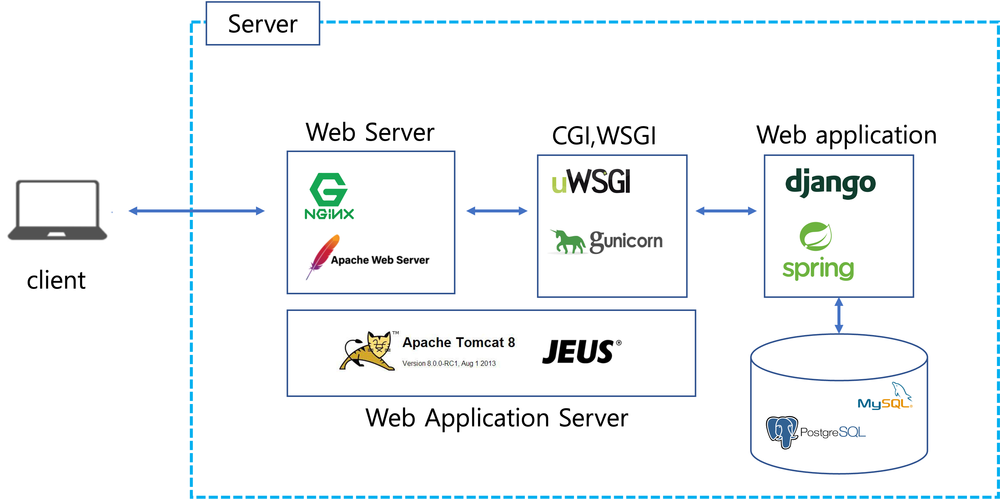
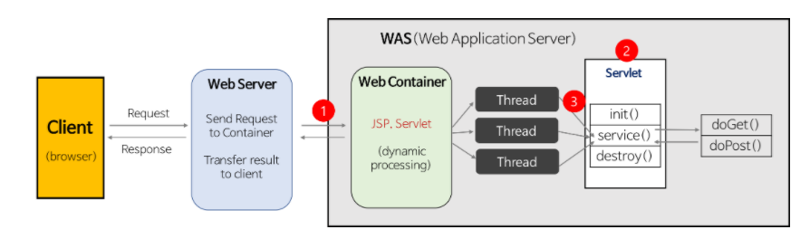

# 서블릿(Servlet)이란 ?
## 서블릿의 등장 배경
* 초창기 Web은 정적 데이터만 처리하는 Web Server여서 사용자의 요청에 따른 다양한 동적 처리가 불가능했다.
* 그래서 등장한 것이 CGI(Common Gateway Interface)

## CGI

* CGI는 서버와 응용 프로그램(외부 프로그램)이 데이터를 주고받기 위한 방법이나 규약을 뜻한다.
* 웹과 외부 프로그램은 프로토콜이 다르다. 이렇게 서로 다른 프로토콜을 연동하는 것이 소프트웨어 게이트웨이이고, 그 표준안이 CGI이다.
* 이름에서 알 수 있듯이 CGI는 Interface이다. 그래서 특정 플랫폼에 의존하지 않고 웹 서버 등으로 부터
외부 프로그램을 호출하는 조합을 말한다. 따라서 CGI를 사용하여 기동되는 프로그램 본체를 CGI로 호칭하는 것은 잘못되었다.
* CGI를 따라서 만들어진 프로그램은 CGI Program 혹은 CGI Script라고 부른다.
* CGI 동작 순서
  * 사용자가 Request를 서버로 보낸다.
  * 서버는 요청에 들어있는 주소가 CGI 프로그램에 대응되는지 확인한다.
  * 대응 된다면 그 프로그램을 실행시키고 받은 요청을 해석해 표준입력(STDIN)과 환경변수로 프로그램에 넘겨준다.
  * CGI Program은 넘겨준 데이터를 받아서 표준출력(STDOUT)으로 반환한다.
  * 서버는 반환한 결과를 받아서 올바른 HTTP 형식으로 클라이언트에게 보낸다.

## CGI를 사용하지 않는 이유
* 멀티프로세스 방식
  * 멀티 프로세스 방식은 요청이 있을 때마다 프로세스를 생성한다.
  * 이는 특히 스크립트 언어에서 치명적이다. 스크립트 언어는 보통 코드를 실행할 때마다 코드를 매번 해석해야하기 때문이다.
  * 프로세스는 자원을 상당히 많이 차지한다.
  * 이를 해결하기 위해 요청에 대응하여 프로세스가 아닌 스레드를 생성하는 자바의 Servlet이 등장했다.

## 서블릿 (Servlet)
* 자바를 사용하여 웹페이지를 동적으로 생성하는 서버측 프로그램 혹은 그 사양을 말한다.
* 사용자의 요청을 처리하고 그 결과를 다시 사용자에게 전송하는 Servlet 클래스의 구현 규칙을 지킨 자바 프로그램
  (사용자의 HTTP 요청에 대해 특정 기능을 수행 후 HTML 문서를 생성하는 등의 응답을 하는 프로그램)
* JSP와 비슷한 점이 있지만 JSP는 HTML 문서 안에 Java 코드를 포함하고 있는 반면, 서블릿은 Java 코드 안에 HTML을 포함하고 있다.
* 이 전과 동일한 요청이 있을시에 최초 생성된 객체를 계속 사용하는 싱글턴 패턴을 사용한다.


## 서블릿의 동작방식

* 요청이 발생하면 쓰레드를 생성하고 Servlet을 실행시킨다.
* Servlet 인터페이스에 따라 Servlet을 관리하고, Servlet 인터페이스에는 메서드가 정의되어있어 필요에 따라 호출한다.
* 메서드의 종류로는 init(), service(), destroy()가 있다.
  * init() : Servlet의 인스턴스를 생성한다.
  * service() : 실제로 기능이 수행되는 곳, HTTP METHOD에 따라 doGet() 또는 doPost()를 호출한다.
  * destroy() : Servlet 인스턴스가 소멸될 때 실행된다. 일반적으로 container가 종료되는 시점에 호출된다.

## 서블릿 컨테이너
* 서블릿 컨테이너는 위에서 말한 init(), service(), destroy()와 같은 메서드를 통해 서블릿의 생명주기를 관리하고
요청에 따른 스레드를 생성해준다.
* 사용자의 요청(Request)를 받아주고 응답(Response)를 보낼 수 있게 웹서버와 소켓을 만들어 통신을 한다.
* 역할
  1. 통신 지원 : 서블릿과 웹 서버가 통신할 수 있는 손쉬운 방법을 제공한다. 통신을 한다면 소켓을 만들고 특정 포트를 리스닝하고 연결이 왔을 때
  스트림을 생성해서 요청을 받는데 이러한 과정을 서블릿 컨테이너가 대신 해준다.
  2. 생명주기 관리 : 위에서 언급한대로 서블릿의 생명주기를 관리한다.
  3. 멀티스레드 관리 : 서블릿 컨테이너는 요청이 들어오면 스레드를 생성해 작업을 수행한다. 동시에 여러 요청이 들어온다면 멀티스레딩 환경으로 작업을 관리한다.

## 서블릿 예제
* 스프링부트 환경에서 서블릿을 등록하고 사용해보자.
```java
package com.example.demo;

import com.example.controller.ExampleServlet;
import org.springframework.boot.SpringApplication;
import org.springframework.boot.autoconfigure.SpringBootApplication;
import org.springframework.boot.autoconfigure.jdbc.DataSourceAutoConfiguration;
import org.springframework.boot.web.servlet.ServletRegistrationBean;
import org.springframework.context.annotation.Bean;

@SpringBootApplication(exclude = DataSourceAutoConfiguration.class)
public class DemoApplication {
   public static void main(String[] args) {
      SpringApplication.run(DemoApplication.class, args);
   }

   /*
    * 기존의 web.xml에서 Servlet을 등록하고 매핑하과 parameter를 등록했던 과정을 아래처럼 Configuration을 이용해 등록할 수 있다.
    * */
   @Bean
   public ServletRegistrationBean<ExampleServlet> getServletRegistrationBean(){
      ServletRegistrationBean<ExampleServlet> registrationBean = new ServletRegistrationBean<>(new ExampleServlet());
      registrationBean.addUrlMappings("/example/*");
      registrationBean.addInitParameter("isAbsolutePath", "true");
      registrationBean.addInitParameter("propertyPath", "src/main/resources/templates");

      return registrationBean;
   }
}
```
* 원래라면 web.xml에 servelt에 대한 정보를 등록하고 사용해야 하지만  
위처럼 SpringBootApplication에 ServletRegistrationBean을 이용하여 Servlet을 Bean으로 등록해 사용할 수 있다.
### Example Servlet
```java
package com.example.controller;

import javax.servlet.ServletException;
import javax.servlet.annotation.WebServlet;
import javax.servlet.http.HttpServlet;
import javax.servlet.http.HttpServletRequest;
import javax.servlet.http.HttpServletResponse;
import java.io.IOException;
import java.io.PrintWriter;

// HttpSerlvet을 상속
public class ExampleServlet extends HttpServlet {
   // intellij 에서 ctrl + o 단축키를 사용해 Override 가능한 메서드 목록을 확인해 아래의 메서드를 생성해주자.
   @Override
   protected void doGet(HttpServletRequest req, HttpServletResponse resp) throws ServletException, IOException {
      String name = req.getParameter("name");
      String age = req.getParameter("age");

      resp.setCharacterEncoding("UTF-8");
      PrintWriter writer = resp.getWriter();
      writer.write("이름 : " + name + " 나이 : " + age);

      writer.close();
   }

   @Override
   protected void doPost(HttpServletRequest req, HttpServletResponse resp) throws ServletException, IOException {
      // Post 로직
   }
}
```
* 위처럼 작성 후 http://localhost:8080/example?name=홍길동&age=25 이런식으로 요청을 보내면된다.
```properties
logging.level.org.apache.coyote.http11=debug
```
* application.properties에 위처럼 추가하면 콘솔창을 통해 HTTP 요청 메세지를 확인할 수 있다.
```
User-Agent: PostmanRuntime/7.29.0
Accept: */*
Postman-Token: 
Host: localhost:8080
Accept-Encoding: gzip, deflate, br
Connection: keep-alive
```
