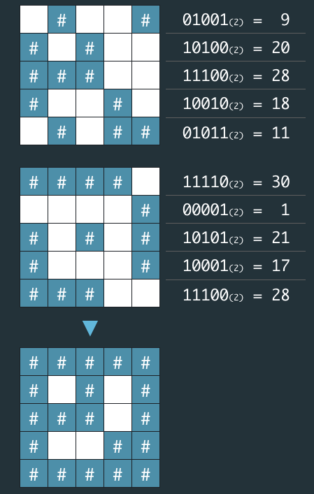

# [1차] 비밀지도
## 문제 설명
네오는 평소 프로도가 비상금을 숨겨놓는 장소를 알려줄 비밀지도를 손에 넣었다.  
그런데 이 비밀지도는 숫자로 암호화되어 있어 위치를 확인하기 위해서는 암호를 해독해야 한다.  
다행히 지도 암호를 해독할 방법을 적어놓은 메모도 함께 발견했다.

1. 지도는 한 변의 길이가 n인 정사각형 배열 형태로, 각 칸은 "공백"(" ") 또는 "벽"("#") 두 종류로 이루어져 있다.
2. 전체 지도는 두 장의 지도를 겹쳐서 얻을 수 있다. 각각 "지도 1"과 "지도 2"라고 하자. 지도 1 또는 지도 2 중 어느 하나라도 벽인 부분은 전체 지도에서도 벽이다.  
지도 1과 지도 2에서 모두 공백인 부분은 전체 지도에서도 공백이다.
3. "지도 1"과 "지도 2"는 각각 정수 배열로 암호화되어 있다.
4. 암호화된 배열은 지도의 각 가로줄에서 벽 부분을 1, 공백 부분을 0으로 부호화했을 때 얻어지는 이진수에 해당하는 값의 배열이다.


  
네오가 프로도의 비상금을 손에 넣을 수 있도록, 비밀지도의 암호를 해독하는 작업을 도와줄 프로그램을 작성하라.

## 입력 형식
입력으로 지도의 한 변 크기 n 과 2개의 정수 배열 arr1, arr2가 들어온다.  
* 1 ≦ n ≦ 16
* arr1, arr2는 길이 n인 정수 배열로 주어진다.
* 정수 배열의 각 원소 x를 이진수로 변환했을 때의 길이는 n 이하이다. 즉, 0 ≦ x ≦ 2n - 1을 만족한다.

## 풀이
### 나의 풀이
```java
class Solution {
    public String[] solution(int n, int[] arr1, int[] arr2) {
        String[] answer = new String[n];
        
        for(int i = 0; i < n; i++) {
            String[] binaryArr1 = makeBinaryArr(arr1[i], n);
            String[] binaryArr2 = makeBinaryArr(arr2[i], n);
            
            StringBuilder sb = new StringBuilder();
            for(int j = 0; j < n; j++) {
                if("1".equals(binaryArr1[j]) || "1".equals(binaryArr2[j])) {
                    sb.append("#");
                } else {
                    sb.append(" ");
                }
            }
            answer[i] = sb.toString();
        }
        
        return answer;
    }
    
    public String[] makeBinaryArr(int num, int length) {
        String binaryStr = Integer.toBinaryString(num);
        String result = "";
        if(binaryStr.length() < length) {
            for(int i = 0; i < length - binaryStr.length(); i++) {
                result += "0";
            }
            binaryStr = result + binaryStr;
        }
        return binaryStr.split("");
    }
}
```  
두 개의 이진수 문자열 배열을 만든 후 둘 중 하나라도 1이 있다면 #을 넣는식으로 만들었다.

### 다른 사람의 풀이
```java
class Solution {
  public String[] solution(int n, int[] arr1, int[] arr2) {
      String[] answer = new String[n];
      String temp;

      for(int i = 0 ; i < n ; i++){
          temp = String.format("%16s", Integer.toBinaryString(arr1[i] | arr2[i]));
          temp = temp.substring(temp.length() - n);
          temp = temp.replaceAll("1", "#");
          temp = temp.replaceAll("0", " ");
          answer[i] = temp;
      }

      return answer;
  }
}
```
String 클래스의 format함수와 비트연산자를 사용했다.  
입력제한에서 16이 최대길이라고해서 %16s로 최소길이를 맞춰주고, substring()으로 길이를 맞춰주었다.  
여기서 비트연산자는 처음봐서 공부가 되었다.

#### 비트연산자
|는 비트 OR 연산자이다.  
비트 OR 연산자는 각각의 비트를 비교하여서 하나라도 1이면 1을 반환, 그렇지않으면 0을 반환한다.
```java
int a = 5;  // 이진수: 0101
int b = 3;  // 이진수: 0011

int result = a | b; // result는 7입니다. 이진수: 0111
```

5를 이진수로 변환하면 0101, 3을 이진수로 변환하면 0011이다.  
각각의 비트를 비교해서 결과를 나타내면, 0111이 되고 이를 다시 십진수로 변환하면 7이 된다.  
  
하나라도 1이라면 #을 적용해야하는 이 문제에 딱인 연산자이다.