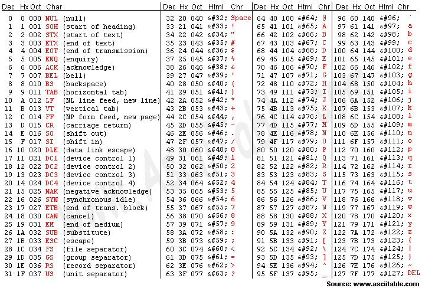

컴퓨터는 모든 문자를 0과 1로 이루어진 이진수로 처리합니다.  
문자도 예외는 아니며 모든 문자와 기호는 컴퓨터에서 이진수로 변환됩니다.

문자를 컴퓨터가 인식할 수 있는 0과 1로 변환하는 과정을 **인코딩**  
인코딩된 문자를 다시 사람이 인식할 수 있도록 바꾸는 과정을 **디코딩**이라고 합니다.

## ASCII
ASCII는 컴퓨터가 문자를 인식하기 위한 가장 기본적인 문자 인코딩 방식입니다.  

예를 들어 'A'는 십진수로 65에 해당합니다.  
이를 이진법을 변환하면 $01000001_{(2)}$입니다.  
컴퓨터는 이 이진수를 사용하여 'A'라는 문자를 인식하고 처리할 수 있습니다.  

추가로 8bit의 인코딩 체계를 이용하여 문자가 128개(0~127)입니다.  
$2^7 = 128$  
나머지 1bit는 패리티 비트라고 하여 데이터 전송의 오류를 검출하기 위해 사용되었습니다.

## 유니코드와 UTF-8
유니코드는 ASCII 코드는 영어 알파벳과 기본적인 기호만 포함되어 있기 때문에 포함되지 않는 문자들을 지원하기 위해서 유니코드가 개발되었습니다.  

유니코드에서는 문자별로 필요한 바이트가 다르다는 문제가 생깁니다. 
모든 문자를 가장 큰 용량(ex. 3byte)으로 표현한다면 영어만을 사용하는 문서에서는 메모리 낭비가 심해질 것 입니다.

그래서 UTF-8, UTF-16 같은 가변길이 인코딩 방식이 등장합니다.

### 유니코드의 주요 인코딩 방식
---
**UTF-8**  
가변 길이 인코딩 방식입니다.  
* ASCII 문자는 1바이트, 그 외 문자는 2~4바이트를 사용합니다.
* 자주 사용하는 문자는 적은 바이트를 사용하고, 덜 자주 사용하는 문자는 더 많은 바이트를 사용합니다.
* 예를 들어, 영어 알파벳 "A"는 1바이트(0x41), 한글 "가"는 3바이트(0xEAB080)로 표현됩니다.

**UTF-16**  
가변 길이 인코딩 방식입니다.  
* 기본적으로 2바이트를 사용하지만, 특정 문자(주로 U+10000 이상)는 4바이트(서로게이트 페어)로 표현됩니다.
* 예를 들어, 영어 알파벳 "A"는 2바이트(0x0041), 한글 "가"는 2바이트(0xAC00), 이모지 "😀"는 4바이트(0xD83DDE00)로 표현됩니다.

**UTF-32**  
고정 길이 인코딩 방식입니다.  
* 모든 문자를 4바이트로 인코딩합니다.
* 예를 들어, 영어 알파벳 "A", 한글 "가", 이모지 "😀" 모두 4바이트로 표현됩니다.

---
